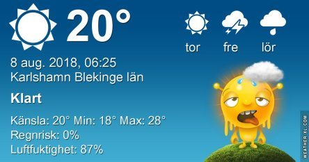
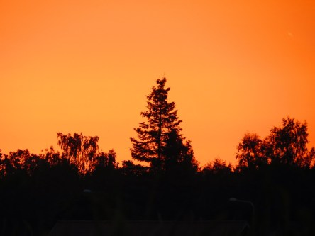

Idag går solen upp 05:17 och ned 20:55. Dagens längd är 15 timmar och 38 minuter. Det är gryning 04:30 och skymning 21:40 Det är dagsljus 17 timmar och 10 minuter. Månen går upp 01:43 och ned 18:32 Månen är belyst 25 %.

 Mest klart 14,6 C  Vindstilla  Luftfuktighet 94 %  hPa 1008 Kl.02:00

 Klart 16,5 C  Vindby 0,3 m/s SW  Luftfuktighet 95 %  hPa 1008 Kl.06:40

 Molnigt 30,7 C  Vindby 3,8 m/s SSW  Luftfuktighet 53 %  hPa 1007 Kl.14:40

 Molnigt 25,7 C  Vindby 2,2 m/s S  Luftfuktighet 66 %  hPa 1005 Kl.19:50

 Ännu en plågsamt varm dag! Och inget regn!

Högst och lägst uppmätta temperatur igår (inofficiellt privat mätare): Max 30,5 C ( i solen ), Min 12,7 C Högst uppmätta vind 3,1 m/s. Högst uppmätta vindby 5,6 m/s

Högst och lägst uppmätta temperatur igår (officiellt enligt [YR.NO](http://www.vackertvader.se/v%C3%A4derstation/karlshamn?utm_source=email&utm_medium=email&utm_campaign=asarum)) Max 25,6 C, Min 13 C Högst uppmätta vind 3,2 m/s. Högst uppmätta vindby 7 m/s

 Nu är månen riktigt smal! Man kan tro att han jojobantar, han är ju tjock och smal om vartannat hahaha.

 Vacker dimma och den eviga soluppgången idag igen.
