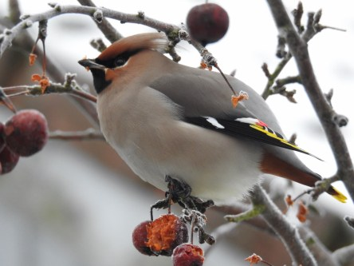

Idag går solen upp 07:41 och ned 16:49. Månen går upp 02:49 och ned 11:29 Månen är belyst 37 %. Dagens längd är 9 timmar och 8 minuter

 Klart och kallt - 10,2 C  Vindstilla  Luftfuktighet 85 %  hPa 1016 Kl.02:05

 Mest molnigt - 5,6 C  Vindstilla  Luftfuktighet 89 %  hPa 1015 Kl.07:00

 Mest molnigt med någon solglimt 5 C  Vindby 2 m/s SE  Luftfuktighet 68 %  hPa 1015 Kl.13:25

 Växlande molnighet - 3,1 C  Vindby 0,7 m/s NW  Luftfuktighet 85 %  hPa 1015 Kl.20:05

 Nu ska det äntligen bli lite mildare igen.

Högst och lägst uppmätta temperatur igår (inofficiellt privat mätare): Max 4 C , Min – 6,8 C Högst uppmätta vind 1,4 m/s. Högst uppmätta vindby 2 m/s.

Högst och lägst uppmätta temperatur igår (officiellt enligt [YR.NO](http://www.vackertvader.se/v%C3%A4derstation/karlshamn?utm_source=email&utm_medium=email&utm_campaign=asarum)) Max 1,3 C, Min – 9,7 C Högst uppmätta vind 1,6 m/s. Högst uppmätta vindby 3,6 m/s

 Den här lilla skönheten kom och hälsade på idag igen!
