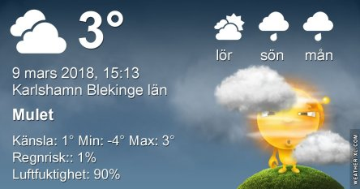
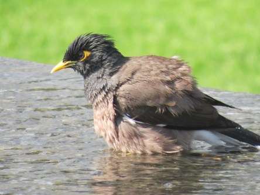

Idag går solen upp 06:33 och ned 17:50. Månen går upp 01:41 och ned 10:00 Månen är belyst 54 %. Dagens längd är 11 timmar och 17 minuter

 Lätt dimma 0,1 C  Vindstilla  Luftfuktighet 96 %  hPa 993 Kl.01:10

 Regn 1 C  Vindby 4,4 m/s N  Luftfuktighet 98 %  hPa 990  Regn 1 mm Kl.06:25

 Molnigt 4,8 C  Vindstilla  Luftfuktighet 95 %  hPa 993  Regn 2,2 mm Kl.14:20

 Molnigt 0,7 C  Vindby 2,4 m/s NW  Luftfuktighet 91 %  hPa 998 Kl.19:50

 Dagen började med dimma som övergick i regn som övergick i grått.

Högst och lägst uppmätta temperatur igår (inofficiellt privat mätare): Max 4,1 C , Min – 1,2 C Högst uppmätta vind 1,7 m/s. Högst uppmätta vindby 3,1 m/s.

Högst och lägst uppmätta temperatur igår (officiellt enligt [YR.NO](http://www.vackertvader.se/v%C3%A4derstation/karlshamn?utm_source=email&utm_medium=email&utm_campaign=asarum)) Max 1,5 C, Min – 0,5 C Högst uppmätta vind 1,4 m/s. Högst uppmätta vindby 4 m/s

 Minnen från Dubai. Överst: Härfågel. Därefter: Vitkindad bulbyl. Därefter: Brun majna. Och sist men inte minst: Skrattmås.
