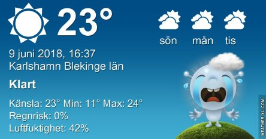
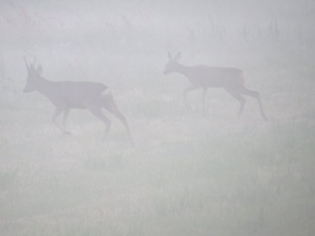
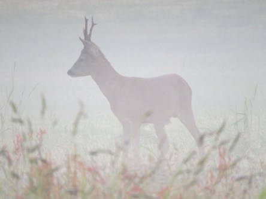
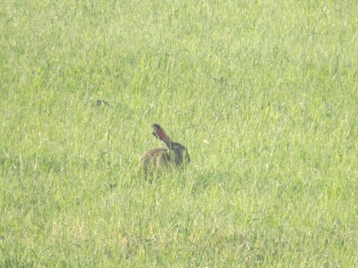
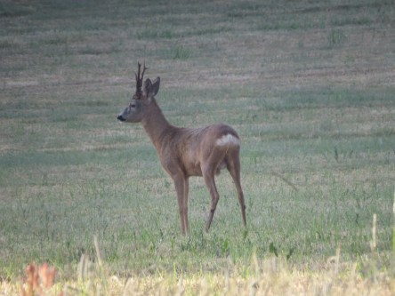
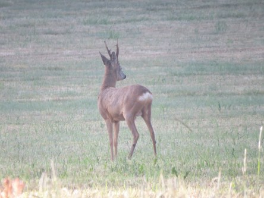

Idag går solen upp 04:14 och ned 21:45. Månen går upp 02:45 och ned 15:40 Månen är belyst 27 %. Dagens längd är 17 timmar och 31 minuter

 Lite moln 9,5 C  Vindstilla  Luftfuktighet 98 %  hPa 1012 Kl.01:55

 Tunna slöjmoln 14,3 C  Vindby 0,3 m/s NW  Luftfuktighet 83 %  hPa 1013 Kl.06:35

 Mest klart 28,1 C  Vindby 2,7 m/s W  Luftfuktighet 35 %  hPa 1012 Kl.15:05

 Tunna slöjmoln 18,5 C  Vindby 1 m/s E  Luftfuktighet 65 %  hPa 1011 Kl.20:30

 Inget regn i sikte. Detta är så påfrestande!

Högst och lägst uppmätta temperatur igår (inofficiellt privat mätare): Max 33,6 C ( i solen ), Min 6,3 C Högst uppmätta vind ? m/s. Högst uppmätta vindby ? m/s

Högst och lägst uppmätta temperatur igår (officiellt enligt [YR.NO](http://www.vackertvader.se/v%C3%A4derstation/karlshamn?utm_source=email&utm_medium=email&utm_campaign=asarum)) Max 24,5 C, Min 5 C Högst uppmätta vind 3,2 m/s. Högst uppmätta vindby 6,3 m/s

 Ännu en morgon där solen gör sig redo att steka oss.

 På flera ställen ligger dimman som ett täcke på marken.

 Solen stiger högre och högre på himmelen.

 Några rådjur betar i dimman.

 En hare slappar i gräset och njuter av det lilla dagg som bildats.

 Rådjuren var kvar en stund senare när dimman lättat.
