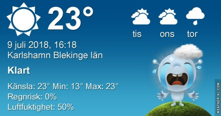
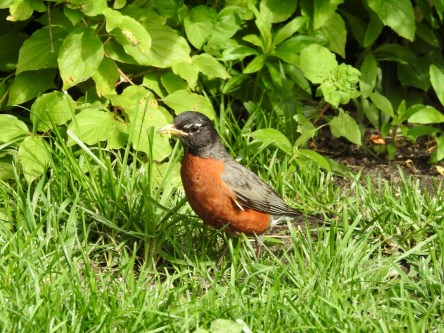

Idag går solen upp 04:26 och ned 21:45. Dagens längd är 17 timmar och 19 minuter. Det är gryning 03:26 och skymning 22:44 Det är dagsljus 19 timmar och 18 minuter. Månen går upp 00:58 och ned 17:09 Månen är belyst 23 %.

 Mest klart 15 C  Vindby 1 m/s SW  Luftfuktighet 75 %   hPa 1012 Kl.01:30

 Växlande molnighet 19,7 C  Vindby 1 m/s NE  Luftfuktighet 66 %  hPa 1010 Kl.07:30

 Växlande molnighet 29,9 C  Vindby 3,4 m/s NW   Luftfuktighet 45 %  hPa 1009 Kl.14:00

 Tunna slöjmoln 19,2 C  Vindby 2 m/s NNE  Luftfuktighet 55 %  hPa 1009 Kl.20:20

 Nu är jag ordentligt trött på torkan. När ska det komma regn?

Högst och lägst uppmätta temperatur igår (inofficiellt privat mätare): Max 27,9 C  ( i solen ), Min 15,5 C Högst uppmätta vind 3,4  m/s. Högst uppmätta vindby 6,1  m/s

Högst och lägst uppmätta temperatur igår (officiellt enligt [YR.NO](http://www.vackertvader.se/v%C3%A4derstation/karlshamn?utm_source=email&utm_medium=email&utm_campaign=asarum)) Max 25,3 C, Min 11,3 C Högst uppmätta vind 3,7 m/s. Högst uppmätta vindby 8,5 m/s

 En vandringstrast i Brooklyn Park. De är lika vanliga som skator här hemma ungefär. Men de är väldigt fina.
