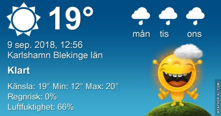
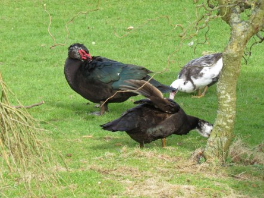
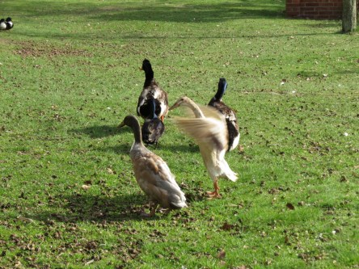

Idag går solen upp 06:20 och ned 19:35. Dagens längd är 13 timmar och 15 minuter. Det är gryning 05:41 och skymning 20:13 Det är dagsljus 14 timmar och 32 minuter. Månen går upp 05:30 och ned 19:47 Månen är belyst 1 %.

 Mest klart 9,4 C  Vindstilla  Luftfuktighet 98 %  hPa 1016 Kl.01:25

 Halvklart 12,2 C  Vindstilla  Luftfuktighet 97 %  hPa 1016 Kl.07:15

 Tunna slöjmoln 25,7 C  Vindby 4 m/s WSW  Luftfuktighet 48 %  hPa 1017 Kl.13:10

 Molnigt 15,1 C  Vindstilla  Luftfuktighet 79 %  hPa 1017 Kl.19:45

 Idag har det varit högsommar igen. Nu hoppas jag på det utlovade regnet, att det verkligen kommer den här gången.

Högst och lägst uppmätta temperatur igår (inofficiellt privat mätare): Max 23,6 C , Min 7,9 C Högst uppmätta vind 3,4 m/s. Högst uppmätta vindby 5,8 m/s

Högst och lägst uppmätta temperatur igår (officiellt enligt [YR.NO](http://www.vackertvader.se/v%C3%A4derstation/karlshamn?utm_source=email&utm_medium=email&utm_campaign=asarum)) Max 18,4 C, Min 8,6 C Högst uppmätta vind 3,7 m/s. Högst uppmätta vindby 8,9 m/s

 Kaja i närbild

 Min lilla kompis.

 Myskankor

 Tripp trapp trull

 Indiska löpänder

 Duva

 Chas på er, här bestämmer jag.

En salig blandning från arkivet del 4
