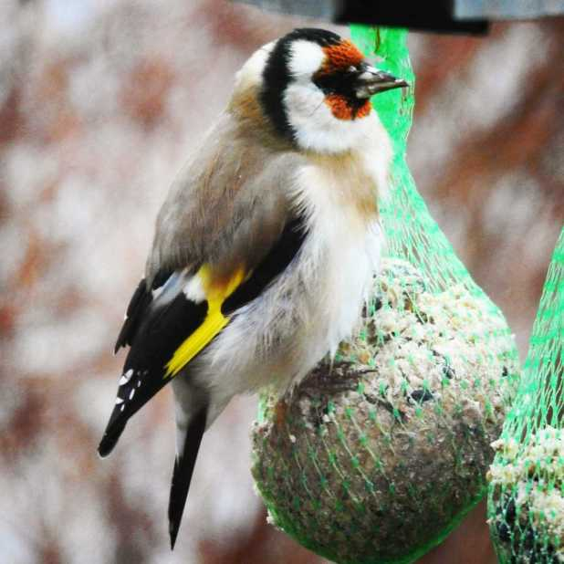
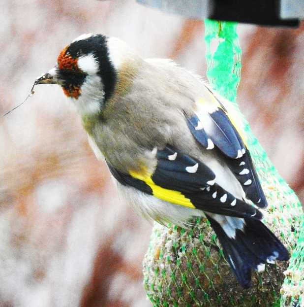

## **Efter en låååång period med nästan bara pilfinkar här...**

så dök den här steglitsen upp utanför köksfönstret. Jag blev överlycklig och fick snabbt fram kameran. Bilderna är tagna genom fönstret så det är inte bästa kvalité men med lite redigering så blev de rätt skapliga ändå.

