## **Vår första levadavandring på Madeira**

_På den första levadavandringen vi gjorde fick vi uppleva hisnande vacker natur och höga berg som sakt5a täcktes av moln och dimma. Det var helt magiskt. Här är några bilder från vår tur bland berg och dalar på Madeira._

_De här små krabaterna fanns överallt_

\[gallery type="rectangular" link="file" size="large" ids="26339,26340,26341,26343,26344,26352,26353,26354,26355,26357"\]

_Här vandrar vi längs levadan för att komma till utsiktsplatsen där bergen ät täckta av dimman._

[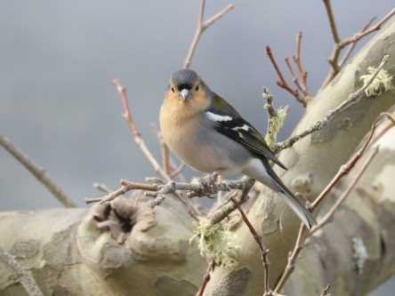](https://worldwideweatherblog.wordpress.com/wp-content/uploads/2019/01/dscn0633-1600x1200.jpg)

[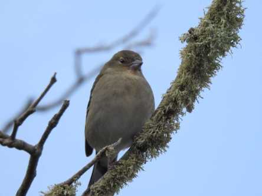](https://worldwideweatherblog.wordpress.com/wp-content/uploads/2019/01/dscn0641-1600x1200.jpg)

[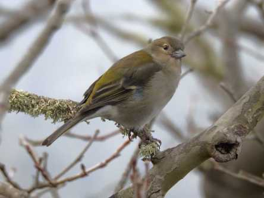](https://worldwideweatherblog.wordpress.com/wp-content/uploads/2019/01/dscn0644-1600x1200.jpg) _Våra små vänner madeirabofinkarna var så nära att vi nästan kunde klappa dem._

 _Nu är vi framme vid målet och utsikten här tar fullständigt andan ur en. Så vackert!_

[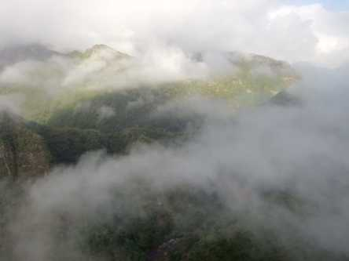](https://worldwideweatherblog.wordpress.com/wp-content/uploads/2019/01/dscn0653-1600x1200.jpg)

[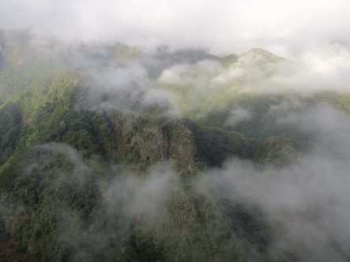](https://worldwideweatherblog.wordpress.com/wp-content/uploads/2019/01/dscn0657-1600x1200.jpg)

[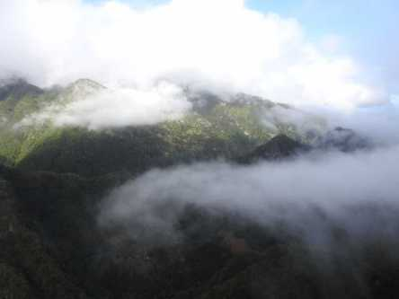](https://worldwideweatherblog.wordpress.com/wp-content/uploads/2019/01/dscn8828-1600x1200.jpg)

[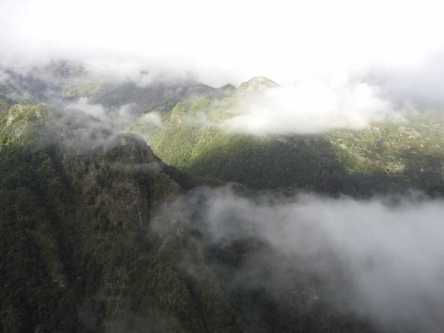](https://worldwideweatherblog.wordpress.com/wp-content/uploads/2019/01/dscn8830-1600x1200.jpg)

[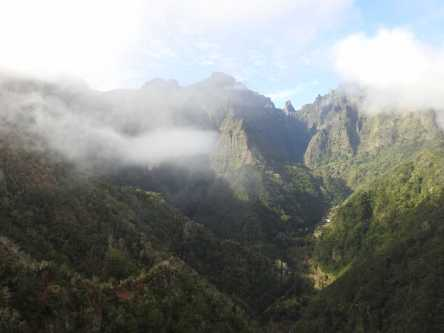](https://worldwideweatherblog.wordpress.com/wp-content/uploads/2019/01/dscn8831-1600x1200.jpg)

[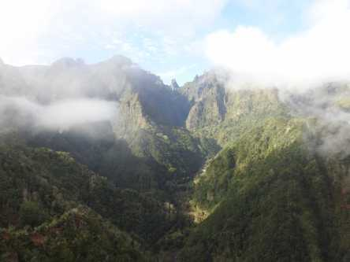](https://worldwideweatherblog.wordpress.com/wp-content/uploads/2019/01/dscn8833-1600x1200.jpg)

[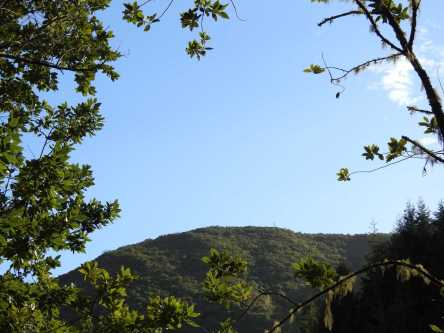](https://worldwideweatherblog.wordpress.com/wp-content/uploads/2019/01/dscn0609-1600x1200.jpg)

[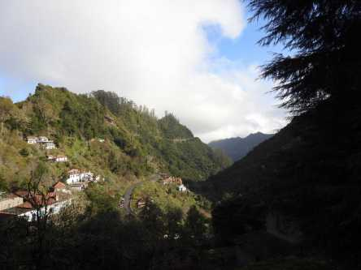](https://worldwideweatherblog.wordpress.com/wp-content/uploads/2019/01/dscn8809-1600x1200.jpg) _Helt magiskt! Det går inte att se sig mätt på det här._

 _Vägen tillbaks bjuder på lika underbar natur. Nästan som en djungel_
