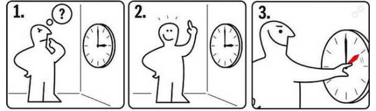
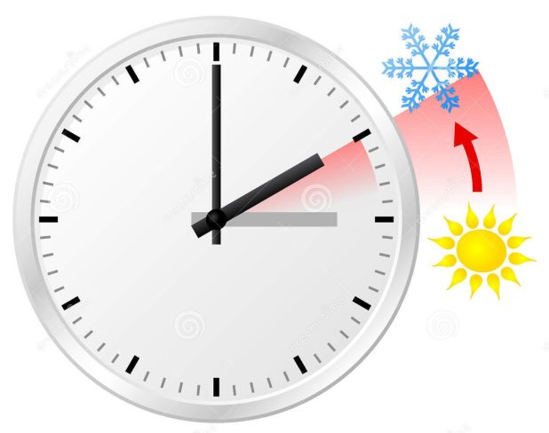

## _**Nu är det dags igen**_

Inatt ställer vi tillbaka klockan en timme från klockan tre till klockan två. Har vi tur blir det max två omställningar till. Senast 2021 ska vi ha bestämt oss för antingen sommar eller vintertid. Själv skulle jag nog föredra sommartid för att slippa mörkret så tidigt på kvällen.

Bild Aftonbladet

\[gallery type="circle" link="file" size="large" ids="32725"\]
