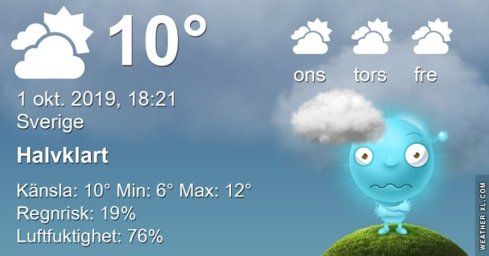

## Tisdag 1 Oktober

I dag gryr dagen i Asarum 06:26. Solen går upp klockan 07:03 och ner klockan 18:37 . Det mörknar vid 19:14. Dagens längd är 11 timmar och 34 minuter. Det är dagsljus 12 timmar och 48 minuter. Månen går upp 10:29 och ned 20:01 Månen är belyst 7 %

I Asarum blir dagen 4 minuter och 37 sekunder kortare. Dagen har blivit 6 timmar och 6 minuter kortare sedan sommarsolståndet. Vintersolstånd om 82 dagar.

Missa inte gyllene timmen som börjar klockan 17:49 i Asarum. Då står solen lågt och kastar ett fint gyllene ljus

 Mest klart 4 C  Vindby 0,3 m/s S  Luftfuktighet 84 %  hPa 995 Kl.01:50

 Mest molnigt 5,9 C  Vindby 1,8 m/s NE  Luftfuktighet 83 %  hPa 994 Kl.07:30

 Molnigt 14,9 C  Vindby 2 m/s S  Luftfuktighet 60 %  hPa 992 Kl.14:40

 Halvklart 2,7 C  Vindstilla  Luftfuktighet 94 %  hPa 991 KL.21:10

Kallt och ruggigt!

Högst och lägst uppmätta temperatur igår (inofficiellt privat mätare) Max 19,2, Min 7,4 C Högst uppmätta vind 3,4 m/s, Högst uppmätta vindby 7,1 m/s

Högst och lägst uppmätta temperatur igår (officiellt enligt [YR.NO](http://www.vackertvader.se/v%C3%A4derstation/karlshamn?utm_source=email&utm_medium=email&utm_campaign=asarum)) Max 16 C, Min 6,3 C Högst uppmätta vind 4,3 m/s. Högst uppmätta vindby 12 m/s

## _**Hinner inte med...**_

så det får bli ett snabbt inlägg med en bild från tidig morgon mitt i stan och en från solnedgången i byn.

