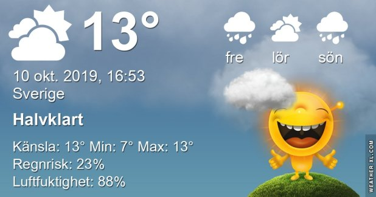

## Torsdag 10 Oktober

I dag gryr dagen i Asarum 06:43. Solen går upp klockan 07:21 och ner klockan 18:13 . Det mörknar vid 18:51. Dagens längd är 10 timmar och 52 minuter. Det är dagsljus 12 timmar och 08 minuter. Månen går upp 17:56 och ned 02:49 Månen är belyst 87 %

I Asarum blir dagen 4 minuter och 37 sekunder kortare. Dagen har blivit 6 timmar och 48 minuter kortare sedan sommarsolståndet. Vintersolstånd om 73 dagar.

Missa inte gyllene timmen som börjar klockan 17:24 i Asarum. Då står solen lågt och kastar ett fint gyllene ljus

 Lätt regn 8,1 C  Vindby 0,7 m/s SE  Luftfuktighet 99 %  hPa 996 KL.01:55

 Molnigt 6,7 C  Vindby 0,8 m/s NE  Luftfuktighet 99 %  hPa 995  Regn 0,5 mm Kl.06:55

 Växlande molnighet 16,7 C  Vindby 2,4 m/s S  Luftfuktighet 71 %  hPa 998 KL.14:05

 Växlande molnighet 8,3 C  Vindby 4,2 m/s W  Luftfuktighet 85 %  hPa 1000 Kl.19:50

 Så skönt att slippa kylan och frysnätterna nu

Högst och lägst uppmätta temperatur igår (inofficiellt privat mätare) Max 18,2, Min 1 C Högst uppmätta vind 2,4 m/s, Högst uppmätta vindby 4,1 m/s

Högst och lägst uppmätta temperatur igår (officiellt enligt [YR.NO](http://www.vackertvader.se/v%C3%A4derstation/karlshamn?utm_source=email&utm_medium=email&utm_campaign=asarum)) Max 14,5 C, Min 0,9 C Högst uppmätta vind 2,4 m/s. Högst uppmätta vindby 6,4  m/s

## _**De gula vännerna har fler klokheter på lager... så här kommer de igen!**_

\[gallery type="rectangular" link="file" size="large" ids="32369,32370,32371,32372,32373,32374,32375,32376,32377,32378,32379,32380,32381,32382,32383,32384,32385,32386"\]

 

## _**Som avslutning...**_

en länk till en lista på olika irritationsmoment i trafiken. Den är mycket läsvärd!

https://www.expressen.se/motor/trafik/har-ar-de-varsta-plagorna-i-hosttrafiken/?utm\_campaign=aob-newsletter-2019v41&utm\_source=expressen-aob-email&utm\_medium=email&utm\_content=link&utm\_term=
