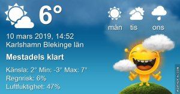

Idag går solen upp 06:30 och ned 17:53 Dagens längd är 11 timmar och 23 minuter. Det är gryning 05:53 och skymning 18:30 Det är dagsljus 12 timmar och 37 minuter. Månen går upp 08:13 och ned 22:00 Månen är belyst 10 %

 Växlande molnighet 1,3 C  Vindby 4,8 m/s SE  Luftfuktighet 85 %  hPa 988 Kl.01:20

Växlande molnighet 3,6 C  Vindby 1,7 m/s W   Luftfuktighet 90 %  hPa 989 Kl.07:05

 Växlande molnighet 10,5 C  Vindby 5,8 m/s SSE  Luftfuktighet 36 %  hPa 991 Kl.13:25

 Växlande molnighet - 0,5 C  Vindstilla  Luftfuktighet 60 %  hPa 992 Kl.19:45

 

 Idag har vi fått se solen och blå himmel!

Högst och lägst uppmätta temperatur igår (inofficiellt privat mätare) Max 7,9 , Min 0,4 C Högst uppmätta vind 4,1 m/s, Högst uppmätta vindby 9,9 m/s

Högst och lägst uppmätta temperatur igår (officiellt enligt [YR.NO](http://www.vackertvader.se/v%C3%A4derstation/karlshamn?utm_source=email&utm_medium=email&utm_campaign=asarum)) Max 6,9 C, Min 2,2 C Högst uppmätta vind 3,7 m/s. Högst uppmätta vindby 11,9 m/s

\[gallery type="square" link="file" size="full" ids="27749,27750,27751,27752,27753,27754,27755"\]

Lite kloka ord som jag satt ihop med olika emojisar!
