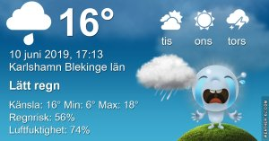

Idag går solen upp 04:14 och ned 21:46 Dagens längd är 17 timmar och 33 minuter. Det är gryning 03:13 och skymning 22:48 Det är dagsljus 19 timmar och 35 minuter. Månen går upp 12:41 och ned 01:52 Månen är belyst 47 %

 Tunna slöjmoln 7,5 C  Vindstilla  Luftfuktighet 97 %  hPa 1019 Kl.02:10

 Mest molnigt 13,1 C  Vindby 0,8 m/s W  Luftfuktighet 92 %  hPa 1018 Kl.07:20

 Molnigt 16,3 C  Vindby 2,7 m/s NW  Luftfuktighet 82 %  hPa 1016  Regn 1 mm Kl.13:45

 Molnigt 15,9 C   Vindby 4 m/s N  Luftfuktighet 72 %  hPa 1013 Kl.20:00

 

 Mörka moln men inget regn! ☹

 

Högst och lägst uppmätta temperatur igår (inofficiellt privat mätare) Max 25,6 ( i solen ) , Min 9,6 C Högst uppmätta vind 4,1 m/s, Högst uppmätta vindby 6,1 m/s

Högst och lägst uppmätta temperatur igår (officiellt enligt [YR.NO](http://www.vackertvader.se/v%C3%A4derstation/karlshamn?utm_source=email&utm_medium=email&utm_campaign=asarum)) Max 20,3 C, Min 7 C Högst uppmätta vind 3,9 m/s. Högst uppmätta vindby 9,4 m/s

 

## _**Ny vecka som börjar med dimma och soluppgång**_

 

\[gallery type="rectangular" link="file" size="large" ids="29827,29828,29829,29830,29831,29832,29833,29834,29835,29836,29837,29838,29839"\]

Ännu en magiskt dimmig morgon med både gamla och nya bekantskaper. Bland annat en häst som är färgad som GB:s Big Pack glass med vanilj och choklad 😊👍
