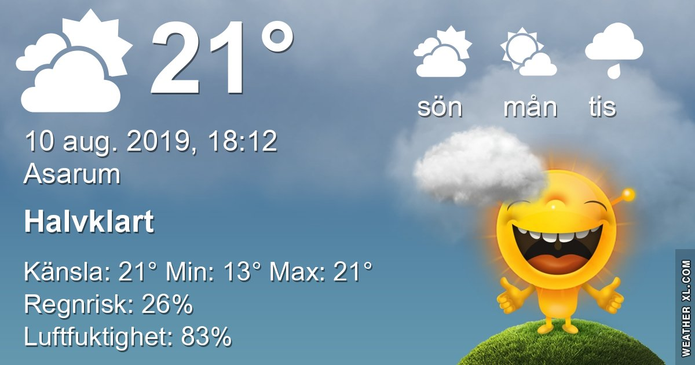

Idag går solen upp 05:20 och ned 20:50 Dagens längd är 15 timmar och 30 minuter. Det är gryning 04:35 och skymning 21:36 Det är dagsljus 17 timmar och 01 minuter. Månen går upp 17:32 och ned 00:23 Månen är belyst 73 %

 Molnigt 12,6 C  Vindstilla  Luftfuktighet 97 %  hPa 1006 Kl.02:!5

 Regn 16,3 C  Vindby 3,7 m/s E  Luftfuktighet 88 %  hPa 1005  Regn 0,5 mm Kl.06:40

 Mest molnigt 24,9 C  Vindby 3,4 m/s NW  Luftfuktighet 77 %  hPa 1002  Regn 9,5 mm Kl.13:05

 Regn och en del åska 17,3 C  Vindby 1,4 m/s E  Luftfuktighet 93 %  hPa 1003  Regn 22,2 mm Kl.20:15

 Det kom äntligen lite regn och åska här ikväll

 

Högst och lägst uppmätta temperatur igår (inofficiellt privat mätare) Max 33,7 ( i solen )  , Min 10,6 C Högst uppmätta vind 2,7 m/s, Högst uppmätta vindby 3,7 m/s

Högst och lägst uppmätta temperatur igår (officiellt enligt [YR.NO](http://www.vackertvader.se/v%C3%A4derstation/karlshamn?utm_source=email&utm_medium=email&utm_campaign=asarum)) Max 24,5 C, Min 10,6 C Högst uppmätta vind 2,8 m/s. Högst uppmätta vindby 7,1 m/s

 

## _**Soluppgång, enfärgad regnbåge och rådjur**_

 

\[gallery type="rectangular" link="file" size="large" ids="31068,31069,31070,31071,31072"\]

 

## _**Och så lite reklam...**_

för mina urtavlor igen

 

\[gallery type="circle" link="file" size="large" ids="31076,31077,31078,31079,31080,31081,31082" orderby="rand"\]
