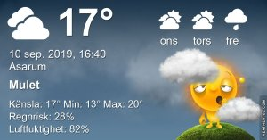

## Tisdag 10 September

I dag gryr dagen i Asarum 05:43. Solen går upp klockan 06:21 och ner klockan 19:33 . Det mörknar vid 20:11. Dagens längd är 13 timmar och 12 minuter. Det är dagsljus 14 timmar och 28 minuter. Månen går upp 18:48 och ned 01:34 Månen är belyst 85 %

I Asarum blir dagen 4 minuter och 36 sekunder kortare. Dagen har blivit 4 timmar och 28 minuter kortare sedan sommarsolståndet. Vintersolstånd om 103 dagar.

Missa inte gyllene timmen som börjar klockan 18:46 i Asarum. Då står solen lågt och kastar ett fint gyllene ljus

 Regn 15,5 C  Vindby 1 m/s E  Luftfuktighet 98 %  hPa 1005  Regn 4 mm Kl.02:10

 Molnigt 16,6 C  Vindby 2,6 m/s SE  Luftfuktighet 97 %  hPa 1002 Kl.07:30

 Växlande molnighet 22,7 C  Vindby 2,4 m/s ENE  Luftfuktighet 72 %  hPa 1002 Kl.14:40

 Växlande molnighet 13,8 C  Vindstilla  Luftfuktighet 95 %  hPa 1004  Regn 4,5 mm Kl.21:10

 Trött och orkeslös är hur jag känner mig just nu!

 

Högst och lägst uppmätta temperatur igår (inofficiellt privat mätare) Max 20,8 , Min 11,8 C Högst uppmätta vind 2,4 m/s, Högst uppmätta vindby 3,4 m/s

Högst och lägst uppmätta temperatur igår (officiellt enligt [YR.NO](http://www.vackertvader.se/v%C3%A4derstation/karlshamn?utm_source=email&utm_medium=email&utm_campaign=asarum)) Max 18,1 C, Min 11,7 C Högst uppmätta vind 3,3 m/s. Högst uppmätta vindby 6,7 m/s

## _**Det får bli ett par låtar med en av mina gamla favoritgrupper idag i brist på ork och tid: The Hollies**_

https://www.youtube.com/watch?v=to2cze58R5E

https://www.youtube.com/watch?v=YCFvXAbSXUQ

Visst var 60-talet härligt!
