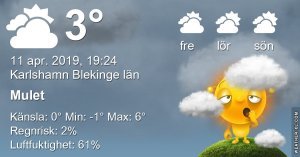

Idag går solen upp 06:06 och ned 19:59 Dagens längd är 13 timmar och 53 minuter. Det är gryning 05:26 och skymning 20:39 Det är dagsljus 15 timmar och 13 minuter. Månen går upp 09:34 och ned 01:42 Månen är belyst 30 %

 Mest molnigt - 0,5 C  Vindby 2 m/s WSW  Luftfuktighet 65 %  hPa 1022 Kl.01:40

 Mest molnigt - 0,3 C  Vindby 2 m/s NW  Luftfuktighet 68 %  hPa 1023 Kl.07:50

 Växlande molnighet 8,8 C  Vindby 2,8 m/s ENE  Luftfuktighet 37 %  hPa 1024 Kl.13:50

 Växlande molnighet 1,7 C  Vindby 1 m/s SE  Luftfuktighet 58 %  hPa 1024 Kl.19:50

 Jag är trött på kylan nu! Lite värme hade inte varit fel. Men ännu hellre regn!

Högst och lägst uppmätta temperatur igår (inofficiellt privat mätare) Max 8,1 , Min – 1,4 C Högst uppmätta vind 2 m/s, Högst uppmätta vindby 4,1 m/s

Högst och lägst uppmätta temperatur igår (officiellt enligt [YR.NO](http://www.vackertvader.se/v%C3%A4derstation/karlshamn?utm_source=email&utm_medium=email&utm_campaign=asarum)) Max 3,8 C, Min – 1,3 C Högst uppmätta vind 3,5 m/s. Högst uppmätta vindby 7,4 m/s

\[gallery type="circle" link="file" size="large" ids="28234,28235,28236,28237" orderby="rand"\]

Idag hade jag den stora äran att få tre rödhakar på besök samtidigt! Det har jag aldrig haft förut. Tyvärr lyckades jag inte få alla tre med på samma bild men jag är ändå nöjd med de bilder jag fick!
