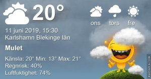

Idag går solen upp 04:14 och ned 21:47 Dagens längd är 17 timmar och 34 minuter. Det är gryning 03:12 och skymning 22:49 Det är dagsljus 19 timmar och 37 minuter. Månen går upp 14:05 och ned 02:11 Månen är belyst 58 %

Regn och åska 13,7 C  Vindby 5,8 m/s SW  Luftfuktighet 76 %  hPa 1012 Kl.02:30

 Molnigt 14,5 C  Vindby 2,8 m/s E  Luftfuktighet 86 %  hPa 1009  Regn 11,2 mm Kl.07:40

 Mest molnigt 24,9 C  Vindby 3,4 m/s SW  Luftfuktighet 71 %   hPa 1010 Kl.15:00

 Molnigt 15,9 C  Vindby 4,4 m/s N  Luftfuktighet 82 %  hPa 1011 Kl.21:20

 

 Blixt och dunder och äntligen lite välbehövligt regn, om än för lite. Och nu är det som en bakugn ute 😣

 

Högst och lägst uppmätta temperatur igår (inofficiellt privat mätare) Max 18,9 , Min 6,9 C Högst uppmätta vind 2,4 m/s, Högst uppmätta vindby 4,1 m/s

Högst och lägst uppmätta temperatur igår (officiellt enligt [YR.NO](http://www.vackertvader.se/v%C3%A4derstation/karlshamn?utm_source=email&utm_medium=email&utm_campaign=asarum)) Max 17,2 C, Min 5,6 C Högst uppmätta vind 2,6 m/s. Högst uppmätta vindby 7,1 m/s

 

## _**Idag krigade de mörka molnen mot solen**_

 

\[gallery type="rectangular" link="file" size="large" ids="29854,29855,29856,29857,29858,29859,29860,29861"\]

Äntligen kom det lite regn och det blixtrade och small så rutorna skallrade här. Efter det försökte solen sig på en kupp mot molnen men lyckades dåligt med det. På eftermiddagen vann hon dock kampen till slut och tillsammans med vinden har hon torkat upp det mesta av det lilla regn som kom inatt.

 

## _**En riktigt glad överraskning**_

 

\[gallery type="circle" link="file" size="full" ids="29853,29852,29851"\]

Min efterlängtade lilla vän är tillbaka!!! Vad jag har saknat dig 😍
