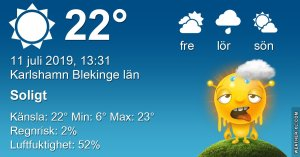
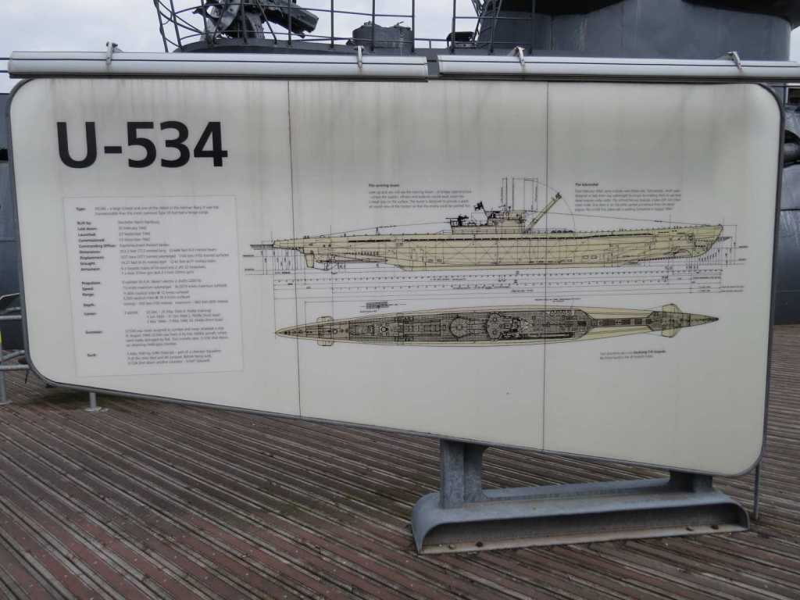

Idag går solen upp 04:28 och ned 21:43 Dagens längd är 17 timmar och 15 minuter. Det är gryning 03:29 och skymning 22:41 Det är dagsljus 19 timmar och 12 minuter. Månen går upp 16:00 och ned 01:09 Månen är belyst 66 %

 Halvklart 6,1 C  Vindstilla Luftfuktighet 98 %  hPa 1008 Kl.01:25

 Halvklart 19,4 C  Vindby 0,7 m/s NW  Luftfuktighet 66 %  hPa 1007 Kl.07:15

 Halvklart 30,3 C  Vindby 2 m/s E  Luftfuktighet 30 %  hPa 1007 Kl.13:20

 Växlande molnighet 21 C  Vindby 0,3 m/s N  Luftfuktighet 46 %  hPa 1006 Kl.19:40

 Idag kom värmen tillbaka efter några svalare dagar med lite regnskurar.

Högst och lägst uppmätta temperatur igår (inofficiellt privat mätare) Max 24,1 ( i solen )  , Min 6 C Högst uppmätta vind 2,7 m/s, Högst uppmätta vindby 5,1 m/s

Högst och lägst uppmätta temperatur igår (officiellt enligt [YR.NO](http://www.vackertvader.se/v%C3%A4derstation/karlshamn?utm_source=email&utm_medium=email&utm_campaign=asarum)) Max 21,4 C, Min 6,7 C Högst uppmätta vind 4,5 m/s. Högst uppmätta vindby 9,9 m/s

 

## _**U-båtsmuseet i Liverpool**_

Vi besökte ubåtsmuseet där de bärgat och styckat upp U-båten U 534  som sänktes den 5 Maj 1945 av engelsmännen. [Här](https://en.wikipedia.org/wiki/German_submarine_U-534) kan du läsa allt om ubåten om du vill.

 

\[gallery type="rectangular" link="file" size="large" ids="30427,30428,30429,30430,30432,30434,30435,30437,30438,30439,30440,30441,30442,30443,30444,30445,30446,30447,30448,30449,30450,30452,30453,30454,30455,30456,30457,30458,30459,30460,30461,30462,30463,30464,30465,30466"\]

Jag varken kan eller vill tänka på hur de människor som var på den här ubåten kände sig när de satt fast i djupet. Otroligt nog var det bara tre av 52 som inte överlevde. När jag tittar in i ubåten kan jag inte förstå hur de lyckades klara sig med tanke på hur det ser ut i den.
