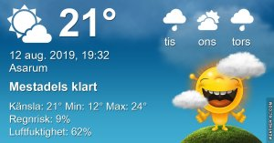

## Måndag 12 augusti

I dag gryr dagen i Asarum 04:39. Solen går upp klockan 05:24 och ner klockan 20:46 . Det mörknar vid 21:30. Dagens längd är 15 timmar och 22 minuter. Det är dagsljus 16 timmar och 51 minuter. Månen går upp 19:33 och ned 00:43 Månen är belyst 89 %

I Asarum blir dagen 4 minuter och 14 sekunder kortare. Dagen har blivit 2 timmar och 18 minuter kortare sedan sommarsolståndet. Vintersolstånd om 132 dagar.

Missa inte gyllene timmen som börjar klockan 19:55 i Asarum. Då står solen lågt och kastar ett fint gyllene ljus.

 

 Mest molnigt 11,8 C  Vindstilla  Luftfuktighet 93 %  hPa 1007 Kl.02:00

 Mest tunna moln 14,8 C  Vindstilla  Luftfuktighet 93 %  hPa 1006 Kl.04:40

 Växlande molnighet 29 C  Vindby 4,6 m/s NE  Luftfuktighet 50 %  hPa 1006 Kl.13:15

 Växlande molnighet 19,1 C  Vindby 1 m/s N  Luftfuktighet 61 %  hPa 1006 Kl.19:50

 Äntligen lite svalare och skönare väder!

 

Högst och lägst uppmätta temperatur igår (inofficiellt privat mätare) Max 28,3 ( i solen )  , Min 13,2 C Högst uppmätta vind 3,1 m/s, Högst uppmätta vindby 7,8 m/s

Högst och lägst uppmätta temperatur igår (officiellt enligt [YR.NO](http://www.vackertvader.se/v%C3%A4derstation/karlshamn?utm_source=email&utm_medium=email&utm_campaign=asarum)) Max 24,3 C, Min 12,1 C Högst uppmätta vind 2,5 m/s. Högst uppmätta vindby 9,9 m/s

 

## _**Lipizzanerhästar och en fjäril**_

 

\[gallery type="rectangular" link="file" size="large" ids="31126,31127,31128,31129,31130"\]

Idag var jag och besökte en kompis som har Lipizzanerhästar! Den ena av dem har stamtavla som går ända tillbaks till 1700-talet. De stackars hästarna var invaderade av flugor som bet dem så hon fick smörja in dem med slav och spraya dem något som flugorna inte gillar. Jag ser hästar överallt med de här skydden för ansiktet så det verkar vara ett utbrett problem med flugor det här året.

 Och sist en bild på en fjäril som jag till slut lyckades fånga med kameran!
