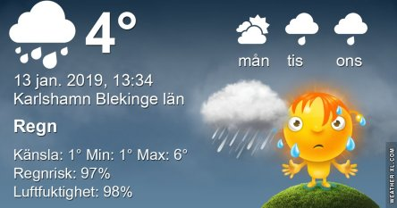

Idag går solen upp 08:26 och ned 15:53 Dagens längd är 7 timmar och 27 minuter. Det är gryning 07:40 och skymning 16:39 Det är dagsljus 8 timmar och 59 minuter. Månen går upp 11:28 och ned 23:57 Månen är belyst 37 %.

Molnigt 1,1 C  Vindstilla  Luftfuktighet 89 %  hPa 991 Kl.02:00

Molnigt 2 C  Vindby 0,3 m/s SE  Luftfuktighet 88 %  hPa 989 Kl.06:35

 Molnigt 5,5 C  Vindby 1,4 m/s W  Luftfuktighet 92 %  hPa 980  Regn 1,5 mm Kl.12:35

Molnigt 4,7 C  Vindby 1 m/s E  Luftfuktighet 91 %  hPa 972  Regn 4,5 mm Kl.20:00

Grått och småregn nästan hela dagen

Högst och lägst uppmätta temperatur igår (inofficiellt privat mätare) Max 2,9 C , Min – 6,8 C Högst uppmätta vind 0,7 m/s, Högst uppmätta vindby 1,4 m/s

Högst och lägst uppmätta temperatur igår (officiellt enligt [YR.NO](http://www.vackertvader.se/v%C3%A4derstation/karlshamn?utm_source=email&utm_medium=email&utm_campaign=asarum)) Max 2,3 C, Min – 5,6 C Högst uppmätta vind 2 m/s. Högst uppmätta vindby 4,4 m/s

 

\[gallery type="circle" link="file" size="large" ids="26509,26508,26507,26506,26505"\]

Färgbehovet är stort just nu så lite blommor och blad från arkivet får rycka in idag.

 

\[gallery type="rectangular" link="file" size="full" ids="26512,26513,26514"\]

Och några kloka ord från Herregud & co
