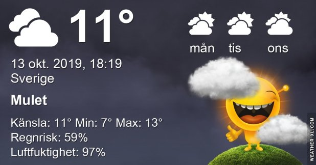

## Söndag 13 Oktober

I dag gryr dagen i Asarum 06:49. Solen går upp klockan 07:27 och ner klockan 18:06 . Det mörknar vid 18:43. Dagens längd är 10 timmar och 39 minuter. Det är dagsljus 11 timmar och 54 minuter. Månen går upp 18:36 och ned 06:20 Månen är belyst 99 %

I Asarum blir dagen 4 minuter och 36 sekunder kortare. Dagen har blivit 6 timmar och 1 minuter kortare sedan sommarsolståndet. Vintersolstånd om 70 dagar.

Missa inte gyllene timmen som börjar klockan 17:16 i Asarum. Då står solen lågt och kastar ett fint gyllene ljus

Mest klart 8,4 C  Vindby 1,4 m/s E  Luftfuktighet 91 %  hPa 1004 Kl.01:45

 Mest molnigt 7 C  Vindby 0,3 m/s SW  Luftfuktighet 95 %  hPa 1005 Kl.07:00

 Mest molnigt 17,9 C   Vindby 1,4 m/s E  Luftfuktighet 70 %  hPa 1008 Kl.13:25

 Regn 10,3 C  Vindby 2 m/s SW  Luftfuktighet 93 %  hPa 1006  Regn 0,5 mm Kl.20:00

 Det fortsätter att vara varmt och skönt!

Högst och lägst uppmätta temperatur igår (inofficiellt privat mätare) Max 19,7, Min 8,9 C Högst uppmätta vind 4,8 m/s, Högst uppmätta vindby 8,2 m/s

Högst och lägst uppmätta temperatur igår (officiellt enligt [YR.NO](http://www.vackertvader.se/v%C3%A4derstation/karlshamn?utm_source=email&utm_medium=email&utm_campaign=asarum)) Max 16,1 C, Min 9,7 C Högst uppmätta vind 2,5 m/s. Högst uppmätta vindby 7,4  m/s

## _**Ur arkivet...**_

blir det idag! Några bilder från i våras på pappa Hacke,staren och pilfinken.

\[gallery type="rectangular" link="file" size="large" ids="32471,32472,32473,32474,32475,32476,32477,32478"\]
