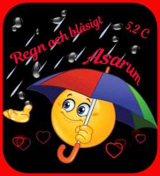

Idag går solen upp 06:22 och ned 17:59 Dagens längd är 11 timmar och 37 minuter. Det är gryning 05:45 och skymning 18:36 Det är dagsljus 12 timmar och 51 minuter. Månen går upp 09:17 och ned 00:26 Månen är belyst 35 %

 Regn 2,4 C  Vindby 3,6 m/s NE  Luftfuktighet 88 %  hPa 992  Regn 0,5 mm Kl.02:05

 Regn och blåsigt 2,2 C  Vindby 5,2 m/s W  Luftfuktighet 91 %  hPa 989  Regn 5,5 mm KL.06:15

 Molnigt 6,7 C  Vindby 4,1 m/s SW  Luftfuktighet 76 %  hPa 990 Kl.14:00

 Molnigt 4,5 C  Vindby 3,1 m/s SE  Luftfuktighet 87 %  hPa 989  Regn 7,7 mm Kl.20:20

 Blött och blåsigt!

Högst och lägst uppmätta temperatur igår (inofficiellt privat mätare) Max 6,3 , Min – 9,4 C Högst uppmätta vind 3,1 m/s, Högst uppmätta vindby 5,1 m/s

Högst och lägst uppmätta temperatur igår (officiellt enligt [YR.NO](http://www.vackertvader.se/v%C3%A4derstation/karlshamn?utm_source=email&utm_medium=email&utm_campaign=asarum)) Max 4 C, Min – 7,1 C Högst uppmätta vind 3,5 m/s. Högst uppmätta vindby 9,1 m/s

\[gallery type="rectangular" link="file" size="large" ids="27808,27809,27810,27811,27812,27813,27814,27815,27816,27817" orderby="rand"\]

Jag fortsätter på samma tema som igår. Den här gången med lite fanatsybilder på månen. Samma originalbild som igår

 Dagens väder: Regn
