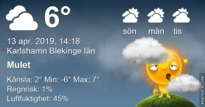

Idag går solen upp 06:01 och ned 20:03 Dagens längd är 14 timmar och 02 minuter. Det är gryning 05:21 och skymning 20:43 Det är dagsljus 15 timmar och 22 minuter. Månen går upp 11:37 och ned 03:42 Månen är belyst 52 %

 Växlande molnighet - 5,1 C  Vindby 0,7 m/s N  Luftfuktighet 68 %  hPa 1027 Kl.01:20

 Växlande molnighet - 2,9 C  Vindby 1,4 m/s W  Luftfuktighet 82 %  hPa 1027 Kl.06:45

 Molnigt 6,9 C  Vindby 3,4 m/s WNW  Luftfuktighet 50 %  hPa 1027 Kl.13:40

 Växlande molnighet 2 C  Vindby 2,2 m/s N  Luftfuktighet 51 %  hPa 1027 Kl.20:15

 En del sol men fortsatt kallt.

Högst och lägst uppmätta temperatur igår (inofficiellt privat mätare) Max 7,8 , Min – 6,1 C Högst uppmätta vind 3,1 m/s, Högst uppmätta vindby 4,8 m/s

Högst och lägst uppmätta temperatur igår (officiellt enligt [YR.NO](http://www.vackertvader.se/v%C3%A4derstation/karlshamn?utm_source=email&utm_medium=email&utm_campaign=asarum)) Max 5,2 C, Min – 5,6 C Högst uppmätta vind 3,4 m/s. Högst uppmätta vindby 7,9 m/s

 Några kloka ord på lördagskvällen.
