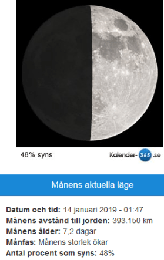
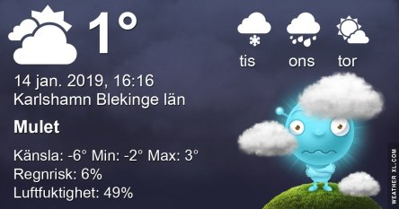

Idag går solen upp 08:24 och ned 15:55 Dagens längd är 7 timmar och 31 minuter. Det är gryning 07:39 och skymning 16:40 Det är dagsljus 9 timmar och 1 minut. Månen går upp 11:40 och ned 01:20 Månen är belyst 48 %.

 Mest klart 0,1 C  Vindby 2,8 m/s SE  Luftfuktighet 70 %  hPa 978 Kl.01:45

 Klart - 3,6 C  Vindby 1,8 m/s ENE  Luftfuktighet 64 %  hPa 983 Kl.06:35

 Tunna slöjmoln 3,1 C  Vindby 3,4 m/s WNW  Luftfuktighet 28 %  hPa 988 Kl.13:40

 Klart - 1,5 C  Vindby 4,1 m/s SE  Luftfuktighet 50 %  hPa 993 Kl.20:00

Kallt men en hel del sol och blå himmel idag

Högst och lägst uppmätta temperatur igår (inofficiellt privat mätare) Max 6 C , Min 1 C Högst uppmätta vind 4,4 m/s, Högst uppmätta vindby 5,8 m/s

Högst och lägst uppmätta temperatur igår (officiellt enligt [YR.NO](http://www.vackertvader.se/v%C3%A4derstation/karlshamn?utm_source=email&utm_medium=email&utm_campaign=asarum)) Max 5,2 C, Min 1 C Högst uppmätta vind 4,9 m/s. Högst uppmätta vindby 14,4 m/s

\[gallery type="rectangular" link="file" size="large" ids="26538,26539,26541,26542,26543" orderby="rand"\]

Kloka ord igen.
