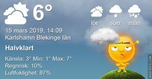

Idag går solen upp 06:17 och ned 18:03 Dagens längd är 11 timmar och 46 minuter. Det är gryning 05:40 och skymning 18:40 Det är dagsljus 13 timmar och 0 minuter. Månen går upp 10:39 och ned 02:54 Månen är belyst 57 %

  Molnigt 3,9 C  Vindby1,4 m/s E  Luftfuktighet 94 %  hPa 987  Regn 0,5 mm Kl.02:20

 Lätt regn 3,8 C  Vindby 0,3 m/s S  Luftfuktighet 94 %  hPa 987  Regn 1,7 mm Kl.06:30

 Molnigt 8 C  Vindby 2,7 m/s SE  Luftfuktighet 76 %  hPa 986  Regn 2,2 mm Kl.14:05

 Regn - 0,1 C  Vindby 1,8 m/s W  Luftfuktighet 88 %  hPa 978  Regn 9 mm Kl.20:05

 Nu vill jag ha vår! Och inget annat!

Högst och lägst uppmätta temperatur igår (inofficiellt privat mätare) Max 11,1 , Min 3,6 C Högst uppmätta vind 3,4 m/s, Högst uppmätta vindby 5,8 m/s

Högst och lägst uppmätta temperatur igår (officiellt enligt [YR.NO](http://www.vackertvader.se/v%C3%A4derstation/karlshamn?utm_source=email&utm_medium=email&utm_campaign=asarum)) Max 6,9 C, Min 3,5 C Högst uppmätta vind 3,4 m/s. Högst uppmätta vindby 9,3 m/s

\[gallery type="rectangular" link="file" size="large" ids="27837,27838,27839,27840,27841,27842,27843,27844,27845,27846"\]

Några kloka ord från Minionerna får det bli idag.

 Dagens väder blev föga förvånande molnigt och regn!
