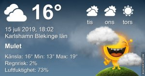

Idag går solen upp 04:34 och ned 21:38 Dagens längd är 17 timmar och 04 minuter. Det är gryning 03:37 och skymning 22:35 Det är dagsljus 18 timmar och 58 minuter. Månen går upp 20:47 och ned 02:57 Månen är belyst 98 %

 Molnigt 13 C  Vindstilla  Luftfuktighet 94 %  hPa 1010 Kl.02:10

 Molnigt och disigt 17,1 C  Vindby 0,7 m/s W  Luftfuktighet 89 %  hPa 1009 Kl.07:15

 Molnigt 21,8 C  Vindby 4,6 m/s NE  Luftfuktighet 73 %  hPa 1007 Kl.14:10

 Molnigt 17,2 C  Vindby 1,8 m/s WSW  Luftfuktighet 65 %  hPa 1006 Kl.19:55

 Äntligen har det varit lite svalare!

 

Högst och lägst uppmätta temperatur igår (inofficiellt privat mätare) Max 33,3 ( i solen )  , Min 9,7 C Högst uppmätta vind 3,1 m/s, Högst uppmätta vindby 5,1 m/s

Högst och lägst uppmätta temperatur igår (officiellt enligt [YR.NO](http://www.vackertvader.se/v%C3%A4derstation/karlshamn?utm_source=email&utm_medium=email&utm_campaign=asarum)) Max 22,6 C, Min 9,1 C Högst uppmätta vind 3,1 m/s. Högst uppmätta vindby 7,4 m/s

 

## _**Fisketur på havet**_

Jag har inte haft tid eller ork att leta bilder att visa idag så det får bli några färska bilder som Johannes tog igår kväll när han var ute och fiskade. Han kom för övrigt hem med härligt färsk torsk som vi har njutit av idag!

\[gallery type="rectangular" link="file" size="large" ids="30521,30522,30523,30524,30525,30526,30527"\]
