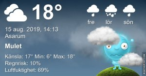

## Torsdag 15 augusti

I dag gryr dagen i Asarum 04:46. Solen går upp klockan 05:30 och ner klockan 20:39 . Det mörknar vid 21:22. Dagens längd är 15 timmar och 9 minuter. Det är dagsljus 16 timmar och 36 minuter. Månen går upp 21:09 och ned 04:46 Månen är belyst 100 %

I Asarum blir dagen 4 minuter och 21 sekunder kortare. Dagen har blivit 2 timmar och 31 minuter kortare sedan sommarsolståndet. Vintersolstånd om 129 dagar.

Missa inte gyllene timmen som börjar klockan 19:48 i Asarum. Då står solen lågt och kastar ett fint gyllene ljus.

 

 Mest klart 6 C  Vindstilla  Luftfuktighet 99 %  hPa 1009 Kl.01:55

 Molnigt 10,3 C  Vindstilla  Luftfuktighet 98 %  hPa 1008 Kl.07:35

 Molnigt 23.7 C  Vindby 2,8 m/s NW  Luftfuktighet 53 %  hPa 1007 Kl.13:35

 Molnigt 12,8 C  Vindby 0,3 m/s W  Luftfuktighet 89 %  hPa 1006  Regn 1,2 mm Kl.20:20

 Höstlikt och kalla nätter är vad som gäller nu!

Högst och lägst uppmätta temperatur igår (inofficiellt privat mätare) Max 20,9 ( i solen )  , Min 7,4 C Högst uppmätta vind 4,4 m/s, Högst uppmätta vindby 4,1 m/s

Högst och lägst uppmätta temperatur igår (officiellt enligt [YR.NO](http://www.vackertvader.se/v%C3%A4derstation/karlshamn?utm_source=email&utm_medium=email&utm_campaign=asarum)) Max 19,1 C, Min 6,4 C Högst uppmätta vind 2,8 m/s. Högst uppmätta vindby 7,9 m/s

 

## _**Och där flög han...**_

innan jag hann ta en bild när han satt så nära för en gång skull.

 

\[gallery type="circle" link="file" size="large" ids="31194,31195"\]

## _**Och återigen dags för kloka or från mina gula vänner**_

 

\[gallery type="rectangular" link="file" size="large" ids="31197,31198,31199,31200"\]
