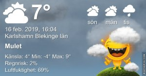

Idag går solen upp 07:25 och ned 17:05 Dagens längd är 9 timmar och 40 minuter. Det är gryning 06:46 och skymning 17:44 Det är dagsljus 10 timmar och 58 minuter. Månen går upp 12:53 och ned 05:08 Månen är belyst 82 %

 Klart - 4,7 C  Vindby 0,3 m/s S  Luftfuktighet 79 %  hPa 1020 Kl.02:25

 Klart - 5,8 C  Vindby 0,3 m/s NW  Luftfuktighet 80 %  hPa 1017 Kl.06:40

 Tunna slöjmoln 14,4 C  Vindby 2,2 m/s ESE  Luftfuktighet 44 %  hPa 1013 Kl.14:15

 Mest klart 4,8 C  Vindby 2 m/s E  Luftfuktighet 63 %  hPa 1013 Kl.20:05

 Sol och vårlikt idag!

Högst och lägst uppmätta temperatur igår (inofficiellt privat mätare) Max 14,1 C , Min - 3,3 C Högst uppmätta vind 2 m/s, Högst uppmätta vindby 3,1 m/s

Högst och lägst uppmätta temperatur igår (officiellt enligt [YR.NO](http://www.vackertvader.se/v%C3%A4derstation/karlshamn?utm_source=email&utm_medium=email&utm_campaign=asarum)) Max 9,2 C, Min - 2,9 C Högst uppmätta vind 2,7 m/s. Högst uppmätta vindby 6,9 m/s

\[gallery type="rectangular" link="file" size="large" ids="27286,27287,27288,27289,27290,27291"\]

Några dagsfärska bilder på mamma Hacke som tittade förbi på lunch idag.
