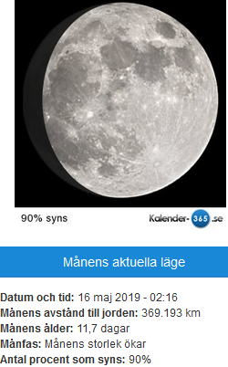

Idag går solen upp 04:46 och ned 21:09 Dagens längd är 16 timmar och 23 minuter. Det är gryning 03:55 och skymning 22:00 Det är dagsljus 18 timmar och 05 minuter. Månen går upp 17:46 och ned 04:20 Månen är belyst 90 %

 Tunna slöjmoln 4,8 C  Vindby 2,2 m/s NNW  Luftfuktighet 49 %  hPa 1022 Kl.02:20

 Växlande molnighet 14,5 C  Vindby 6,2 m/s WNW  Luftfuktighet 43 %  hPa 1020 Kl.07:40

 Halvklart och blåsigt 22,3 C  Vindby 7,5 m/s SW  Luftfuktighet 24 %  hPa 1018 Kl.14:35

 Ökande molnighet 15 C  Vindby 5,1 m/s NW  Luftfuktighet 30 %  hPa 1017 Kl.20:00

 Idag har det varit högsommarvärme här, men blåsigt.

Högst och lägst uppmätta temperatur igår (inofficiellt privat mätare) Max 20 , Min – 3,6 C Högst uppmätta vind 3,1 m/s, Högst uppmätta vindby 4,1 m/s

Högst och lägst uppmätta temperatur igår (officiellt enligt [YR.NO](http://www.vackertvader.se/v%C3%A4derstation/karlshamn?utm_source=email&utm_medium=email&utm_campaign=asarum)) Max 15,5 C, Min – 2,7 C Högst uppmätta vind 3,7 m/s. Högst uppmätta vindby 8,9 m/s

\[gallery type="rectangular" link="file" size="large" ids="28745,28746,28747,28748,28749,28750,28751,28752,28753,28754,28755,28756,28757,28758,28759,28760,28761,28762,28763,28764,28765,28766,28767,28768,28769,28770,28771,28772,28773,28774,28775,28776,28777,28778,28779,28780,28781,28782"\]

Vi fortsätter med en härlig båttur under Golden Gatebron och runt Alcatraz i ett härligt soligt väder, som är väldigt ovanligt i San Fransisco. Jag skulle absolut kunna tänka mig att åka hit någon gång igen.
