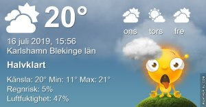

Idag går solen upp 04:35 och ned 21:37 Dagens längd är 17 timmar och 02 minuter. Det är gryning 03:39 och skymning 22:33 Det är dagsljus 18 timmar och 54 minuter. Månen går upp 21:37 och ned 03:45 Månen är belyst 99 %

 Växlande molnighet 9,3 C  Vindstilla  Luftfuktighet 92 %  hPa 1005 Kl.01:35

 Växlande molnighet 12,4 C  Vindby 0,8 m/s SE  Luftfuktighet 89 %  hPa 1005 Kl.06:45

 Lätta regnskurar 23,8 C  Vindby 3,1 m/s NW  Luftfuktighet 53 %  hPa 1004 Kl.13:50

 Mest molnigt 16,2 C  Vindby 3,1 m/s NW  Luftfuktighet 56 %  hPa 1005 Kl.21:00

 Svarta moln men inget mätbart regn än så länge! Hopplöst!

Högst och lägst uppmätta temperatur igår (inofficiellt privat mätare) Max 21,8  , Min 12,9 C Högst uppmätta vind 2,7 m/s, Högst uppmätta vindby 4,1 m/s

Högst och lägst uppmätta temperatur igår (officiellt enligt [YR.NO](http://www.vackertvader.se/v%C3%A4derstation/karlshamn?utm_source=email&utm_medium=email&utm_campaign=asarum)) Max 19 C, Min 10,6 C Högst uppmätta vind 3,5 m/s. Högst uppmätta vindby 7,3 m/s

## _**Morgonbilder från havet**_

 

\[gallery type="rectangular" link="file" size="large" ids="30542,30543,30544,30545,30546,30547,30548,30549,30550,30551,30552,30553,30554"\]
