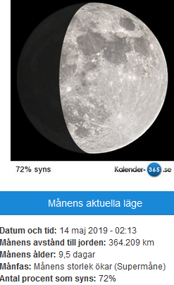
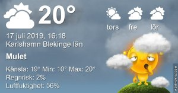

Idag går solen upp 04:37 och ned 21:36 Dagens längd är 16 timmar och 59 minuter. Det är gryning 03:41 och skymning 22:31 Det är dagsljus 18 timmar och 50 minuter. Månen går upp 22:14 och ned 04:43 Månen är belyst 100 %

 Mest molnigt 12,4 C  Vindby 0,8 m/s N  Luftfuktighet 79 %  hPa 1007 Kl.01:40

 Mest klart 14,1 C  Vindby 1,8 m/s N  Luftfuktighet 69 %  hPa 1008 Kl.06:45

 Växlande molnighet 27,6 C  Vindby 2,6 m/s NE  Luftfuktighet 42 %  hPa 1008 Kl.14:30

 Växlande molnighet 17,8 C  Vindby 1,8 m/s W  Luftfuktighet 67 %  hPa 1008 Kl.20:00

 Nu känns det att semestern är över och man ska försöka komma in i jobbrutinerna igen. För varmt att sova på dagen och svårt att komma i säng på kvällen = dötrött!

Högst och lägst uppmätta temperatur igår (inofficiellt privat mätare) Max 26 ( i solen )  , Min 9,3 C Högst uppmätta vind 2,7 m/s, Högst uppmätta vindby 5,1 m/s

Högst och lägst uppmätta temperatur igår (officiellt enligt [YR.NO](http://www.vackertvader.se/v%C3%A4derstation/karlshamn?utm_source=email&utm_medium=email&utm_campaign=asarum)) Max 20,9 C, Min 10,8 C Högst uppmätta vind 4,1 m/s. Högst uppmätta vindby 11,6 m/s

 

## _**Fullmåne och lite annat från tidig morgon**_

\[gallery type="rectangular" link="none" size="large" ids="30563,30564,30565,30566,30567,30568,30569,30570,30571,30572"\]
