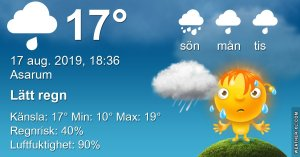

## Lördag 17 augusti

I dag gryr dagen i Asarum 04:51. Solen går upp klockan 05:34 och ner klockan 20:34 . Det mörknar vid 21:17. Dagens längd är 15 timmar och 0 minuter. Det är dagsljus 16 timmar och 26 minuter. Månen går upp 21:43 och ned 07:09 Månen är belyst 98 %

I Asarum blir dagen 4 minuter och 21 sekunder kortare. Dagen har blivit 2 timmar och 39 minuter kortare sedan sommarsolståndet. Vintersolstånd om 127 dagar.

Missa inte gyllene timmen som börjar klockan 19:44 i Asarum. Då står solen lågt och kastar ett fint gyllene ljus.

 Böljemoln 10,5 C  Vindstilla  Luftfuktighet 97 %  hPa 1008 Kl.02:10

 Mest molnigt 11,6 C  Vindstilla Luftfuktighet 97 %  hPa 1007 Kl.06:40

 Molnigt 22,3 C  Vindby 3,6 m/s NE  Luftfuktighet 73 %  hPa 1005  Regn 0,7 mm Kl.14:30

 Regn 17 C  Vindby 2 m/s NE  Luftfuktighet 84 %  hPa 1003  Regn 1,2 mm Kl.20:40

Regn i små mängder, men det är i alla fall regn!

Högst och lägst uppmätta temperatur igår (inofficiellt privat mätare) Max 27,2 ( i solen )  , Min 12,4 C Högst uppmätta vind 2,4 m/s, Högst uppmätta vindby 4,1 m/s

Högst och lägst uppmätta temperatur igår (officiellt enligt [YR.NO](http://www.vackertvader.se/v%C3%A4derstation/karlshamn?utm_source=email&utm_medium=email&utm_campaign=asarum)) Max 23,1 C, Min 11,1 C Högst uppmätta vind 3,2 m/s. Högst uppmätta vindby 9,5 m/s

 

## **Inget annat än soluppgång att visa**

 

\[gallery type="rectangular" link="file" size="large" ids="31229,31230,31231,31232,31233,31234,31235,31236,31237,31238"\]
