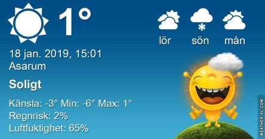

Idag går solen upp 08:20 och ned 16:03 Dagens längd är 7 timmar och 43 minuter. Det är gryning 07:35 och skymning 16:47 Det är dagsljus 9 timmar och 12 minuter. Månen går upp 13:24 och ned 05:07 Månen är belyst 86 %.

 Mest klart - 5,3 C  Vindby 1 m/s ESE  Luftfuktighet 65 %  hPa 999 Kl.01:50

 Klart - 6,7 C  Vindby 2,4 m/s S  Luftfuktighet 70 %  hPa 1003 Kl.06:20

 Mest klart 3,1 C  Vindby 2,4 m/s ENE  Luftfuktighet 43 %  hPa 1007 Kl.14:05

 Mest klart - 8,1 C  Vindstilla  Luftfuktighet 75 %  hPa 1009 Kl.19:50

 Äntligen lite sol och blå himmel. Kylan kan jag dock avstå ifrån.

Högst och lägst uppmätta temperatur igår (inofficiellt privat mätare) Max 3,5 C , Min – 8 C Högst uppmätta vind 2 m/s, Högst uppmätta vindby 3,4 m/s

Högst och lägst uppmätta temperatur igår (officiellt enligt [YR.NO](http://www.vackertvader.se/v%C3%A4derstation/karlshamn?utm_source=email&utm_medium=email&utm_campaign=asarum)) Max 5,1 C, Min – 2,3 C Högst uppmätta vind 3,7 m/s. Högst uppmätta vindby 8,9 m/s

\[gallery type="rectangular" link="file" size="full" ids="26700,26701,26702,26703,26704,26705,26706,26707" orderby="rand"\]

Nu när det är mörkt och kallt får arkivet hjälpa till med lite sommarkänsla. Här har jag tittat tillbaka på vår resa till Miami för ett par år sedan. Där var det fullt av sådana här små ödlor överallt. Så jag som älskar ödlor trivdes som fisken i vattnet. De här bilderna har Johannes tagit. Vad det är för ödlor vet jag däremot inte.
