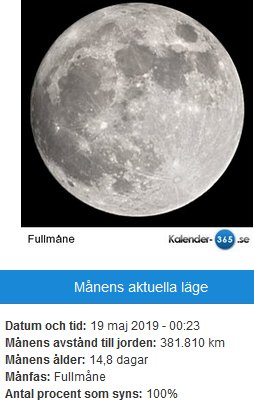

Idag går solen upp 04:12 och ned 21:51 Dagens längd är 17 timmar och 39 minuter. Det är gryning 03:09 och skymning 22:55 Det är dagsljus 19 timmar och 46 minuter. Månen går upp 22:55 och ned 05:01 Månen är belyst 100 %

 

 Klart 9,3 C  Vindstilla  Luftfuktighet 94 %  hPa 1016 Kl.02:00

 Halvklart 21,5 C  Vindby 0,7 m/s SE  Luftfuktighet 60 %  hPa 1016 Kl.07:10

 Tunna slöjmoln 27,5 C  Vindby 3,4 m/s ESE  Luftfuktighet 43 %  hPa 1015 Kl.15:00

 Tunna slöjmoln 19,3 C  Vindby 2,6 m/s E  Luftfuktighet 62 %  hPa 1012 Kl.19:45

 

 Nu måste det komma regn snart! Gräsmattorna börjar gulna och allt blommar över på rekordtid. Det är kruttorrt i marken.

 

Högst och lägst uppmätta temperatur igår (inofficiellt privat mätare) Max 28.1 ( i solen )  , Min 8,7 C Högst uppmätta vind 3,4 m/s, Högst uppmätta vindby 4,8 m/s

Högst och lägst uppmätta temperatur igår (officiellt enligt [YR.NO](http://www.vackertvader.se/v%C3%A4derstation/karlshamn?utm_source=email&utm_medium=email&utm_campaign=asarum)) Max 23,5 C, Min 9,5 C Högst uppmätta vind 3,2 m/s. Högst uppmätta vindby 7,8 m/s

 

## _**Från fullmåne och dimma till en sömnig hare**_

 

 

\[gallery type="rectangular" link="file" size="large" ids="29999,30000,30001,30002,30003,30004,30005,30006,30007,30008"\]

Idag var det fullmåne och klar himmel vilket ledde till en outhärdligt varm dag igen. Men några djur orkade ändå visa sig på morgonen.
