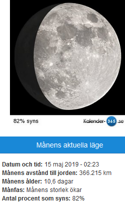
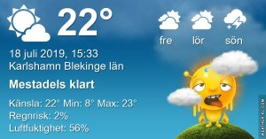

Idag går solen upp 04:38 och ned 21:34 Dagens längd är 16 timmar och 56 minuter. Det är gryning 03:43 och skymning 22:29 Det är dagsljus 18 timmar och 46 minuter. Månen går upp 22:43 och ned 05:49 Månen är belyst 99 %

 Växlande molnighet 9,7 C  Vindstilla  Luftfuktighet 96 %  hPa 1008 Kl.01:50

 Mest klart 15,1 C  Vindby 0,7 m/s W  Luftfuktighet 71 %  hPa 1008 Kl.07:00

 Mest klart 27,6 C  Vindby 3 m/s N  Luftfuktighet 45 %  hPa 1008 KL.14:25

 Mest klart 19 C  Vindby 2 m/s NE  Luftfuktighet 64 %  hPa 1008 Kl.19:45

 Ännu en varm och torr dag! Hoppet om regn har jag gett upp för längesedan!

Högst och lägst uppmätta temperatur igår (inofficiellt privat mätare) Max 34,3 ( i solen )  , Min 8 C Högst uppmätta vind 2,4 m/s, Högst uppmätta vindby 4,1 m/s

Högst och lägst uppmätta temperatur igår (officiellt enligt [YR.NO](http://www.vackertvader.se/v%C3%A4derstation/karlshamn?utm_source=email&utm_medium=email&utm_campaign=asarum)) Max 23,2 C, Min 8,3 C Högst uppmätta vind 3,5 m/s. Högst uppmätta vindby 7,3 m/s

## _**Några "konstverk" gjorda med app i telefonen**_

Roade mig med lite lek med gamla bilder och resultatet blev ganska ok med tanke på begränsningarna med en telefonapp

 

\[gallery type="rectangular" link="file" size="large" ids="30582,30583,30584,30585,30586"\]
