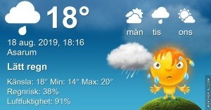

## Lördag 18 augusti

I dag gryr dagen i Asarum 04:53. Solen går upp klockan 05:36 och ner klockan 20:32 . Det mörknar vid 21:14. Dagens längd är 14 timmar och 56 minuter. Det är dagsljus 16 timmar och 21 minuter. Månen går upp 21:56 och ned 08:20 Månen är belyst 95 %

I Asarum blir dagen 4 minuter och 25 sekunder kortare. Dagen har blivit 2 timmar och 44 minuter kortare sedan sommarsolståndet. Vintersolstånd om 126 dagar.

Missa inte gyllene timmen som börjar klockan 19:42 i Asarum. Då står solen lågt och kastar ett fint gyllene ljus.

 

 Molnigt 15,7 C  Vindby 0,8 m/s E  Luftfuktighet 95 %  hPa 1003 Kl.01:25

 Molnigt 17,8 C  Vindby 1,4 m/s WSW  Luftfuktighet 97 %  hPa 1001 Kl.07:30

 Molnigt 24,1 C  Vindby 2 m/s ESE  Luftfuktighet 77 %  hPa 1001 Kl.13:25

 Regn17,2 C  Vindby 0,3 m/s NW  Luftfuktighet 96 %  hPa 999  Regn 12,2 mm Kl.20:00

Äntligen regnar det mer än några minuter!

Högst och lägst uppmätta temperatur igår (inofficiellt privat mätare) Max 24,9 , Min 9,5 C Högst uppmätta vind 3,4 m/s, Högst uppmätta vindby 5,8 m/s

Högst och lägst uppmätta temperatur igår (officiellt enligt [YR.NO](http://www.vackertvader.se/v%C3%A4derstation/karlshamn?utm_source=email&utm_medium=email&utm_campaign=asarum)) Max 18,9 C, Min 8,9 C Högst uppmätta vind 3 m/s. Högst uppmätta vindby 8,6 m/s

 

## _**Äntligen regnar det och vad passar väl bättre då än den här låten?**_

https://www.youtube.com/watch?v=swloMVFALXw

## _**Och så lite reklam igen...**_

för mina urtavlor

\[gallery type="circle" link="file" size="large" ids="31252,31253,31254,31255,31256,31257,31258,31259,31260,31261,31262,31263,31264,31265,31266,31267,31268,31269,31270"\]
