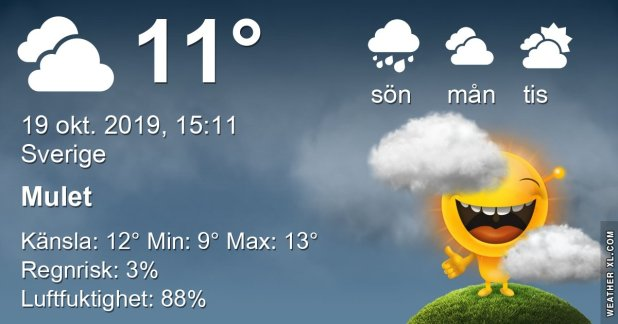

## Lördag 19 Oktober

I dag gryr dagen i Asarum 07:01. Solen går upp klockan 07:40 och ner klockan 17:51 . Det mörknar vid 18:29. Dagens längd är 10 timmar och 11 minuter. Det är dagsljus 11 timmar och 28 minuter. Månen går upp 21:03 och ned 13:37 Månen är belyst 76 %

I Asarum blir dagen 4 minuter och 37 sekunder kortare. Dagen har blivit 7 timmar och 29 minuter kortare sedan sommarsolståndet. Vintersolstånd om 64 dagar.

Missa inte gyllene timmen som börjar klockan 16:59 i Asarum. Då står solen lågt och kastar ett fint gyllene ljus

 

 Mest molnigt 9,7 C  Vindby 1,2 m/s N  Luftfuktighet 93 %  hPa 1001 Kl.01:50

 Tunna slöjmoln 9,5 C  Vindby 2 m/s SW  Luftfuktighet 92 %  hPa 1002 Kl.07:25

 Molnigt 14 C  Vindby 2 m/s N  Luftfuktighet 80 %  hPa 1004 Kl.13:45

 Halvklart 8,9 C  Vindby 0,7 m/s NW  Luftfuktighet 90 %   hPa 1004 Kl.19:55

Det började grått men nu kommer solen fram bland molnen

Högst och lägst uppmätta temperatur igår (inofficiellt privat mätare) Max 13,7, Min 9,9 C Högst uppmätta vind 2,7 m/s, Högst uppmätta vindby 6,5 m/s

Högst och lägst uppmätta temperatur igår (officiellt enligt [YR.NO](http://www.vackertvader.se/v%C3%A4derstation/karlshamn?utm_source=email&utm_medium=email&utm_campaign=asarum)) Max 12,6 C, Min 10 C Högst uppmätta vind 3,7 m/s. Högst uppmätta vindby 9,4  m/s

## _**Mina gula vänner rycker in när fantasin tryter**_

De är alltid lika pålitliga!

\[gallery type="rectangular" link="file" size="large" ids="32602,32603,32604,32605,32606,32607,32608,32610,32611,32612,32613,32614,32615"\]
