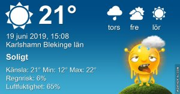

Idag går solen upp 04:12 och ned 21:52 Dagens längd är 17 timmar och 40 minuter. Det är gryning 03:09 och skymning 22:55 Det är dagsljus 19 timmar och 46 minuter. Månen går upp 23:40 och ned 05:54 Månen är belyst 97 %

 Halvklart 11,3 C  Vindstilla  Luftfuktighet 96 %  hPa 1011 Kl.01:20

 Halvklart 26 C  Vindby 2 m/s E  Luftfuktighet 60 %  hPa 1009 Kl.08:00

 Halvklart 28.4 C  Vindby 1 m/s NE  Luftfuktighet 43 %  hPa 1008 Kl.15:00

 Halvklart 18.4 C  Vindby 0,3 m/s N  Luftfuktighet 71 %  hPa 1005 Kl.21:05

 

 Så varmt så jag står inte ut snart!

 

Högst och lägst uppmätta temperatur igår (inofficiellt privat mätare) Max 31,6 ( i solen )  , Min 8,1  C Högst uppmätta vind 2,4 m/s, Högst uppmätta vindby 4,4 m/s

Högst och lägst uppmätta temperatur igår (officiellt enligt [YR.NO](http://www.vackertvader.se/v%C3%A4derstation/karlshamn?utm_source=email&utm_medium=email&utm_campaign=asarum)) Max 21,9 C, Min 7,8 C Högst uppmätta vind 3,5 m/s. Högst uppmätta vindby 7,2 m/s

 

Orken tryter och jag känner att semestern behövs mer än någonsin! Värmen tar ut sin rätt och det är nästan så att jag har lust att boka en resa till nordpolen!
