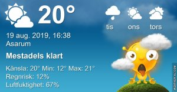

## Måndag 19 augusti

I dag gryr dagen i Asarum 04:51. Solen går upp klockan 05:38 och ner klockan 20:29 . Det mörknar vid 21:12. Dagens längd är 14 timmar och 51 minuter. Det är dagsljus 16 timmar och 17 minuter. Månen går upp 22:10 och ned 09:31 Månen är belyst 89 %

I Asarum blir dagen 4 minuter och 26 sekunder kortare. Dagen har blivit 2 timmar och 48 minuter kortare sedan sommarsolståndet. Vintersolstånd om 125 dagar.

Missa inte gyllene timmen som börjar klockan 19:40 i Asarum. Då står solen lågt och kastar ett fint gyllene ljus.

 

 Växlande molnighet 13,4 C  Vindby 1,4 m/s E  Luftfuktighet 97 %  hPa 1002 Kl.02:10

 Mest molnigt 13,9 C  Vindby 0,7 m/s E  Luftfuktighet 99 %  hPa 1006 Kl.07:15

 Mest molnigt med någon solglimt 25,6 C  Vindby 4,6 m/s NE  Luftfuktighet 61 %  hPa 1007 Kl.13:15

 Molnigt 14,1 C  Vindby 2 m/s SE  Luftfuktighet 92 %  hPa 1010  Regn 3,7 mm Kl.19:55

 Helt plötsligt regnar det varenda dag här!

 

Högst och lägst uppmätta temperatur igår (inofficiellt privat mätare) Max 24,2 , Min 15,3 C Högst uppmätta vind 2 m/s, Högst uppmätta vindby 3,7 m/s

Högst och lägst uppmätta temperatur igår (officiellt enligt [YR.NO](http://www.vackertvader.se/v%C3%A4derstation/karlshamn?utm_source=email&utm_medium=email&utm_campaign=asarum)) Max 20,1 C, Min 14,1 C Högst uppmätta vind 2,4 m/s. Högst uppmätta vindby 6,4 m/s

 

## _**Först dimma, sen mörka moln**_

 

\[gallery type="rectangular" link="file" size="large" ids="31283,31284,31285,31286,31287,31288,31289,31290"\]
