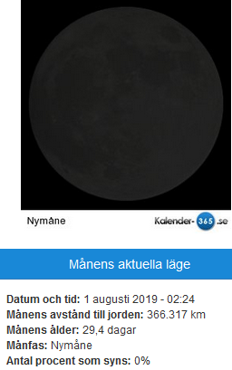
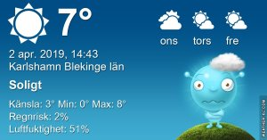

Idag går solen upp 06:29 och ned 19:40 Dagens längd är 13 timmar och 11 minuter. Det är gryning 05:51 och skymning 20:19 Det är dagsljus 14 timmar och 28 minuter. Månen går upp 06:21 och ned 16:06 Månen är belyst 11 %

 Klart - 0,7 C  Vindby 1,4 m/s ENE  Luftfuktighet 69 %  hPa 1021 Kl.01:15

 Klart 0,8 C  Vindby 3 m/s E  Luftfuktighet 74 %  hpa 1019 Kl.06:30

 Klart 11,6 C  Vindby 5,2 m/s NNE  Luftfuktighet 32 %  hPa 1015 Kl.14:15

 Klart 3,7 C  Vindby 2,6 m/s NE  Luftfuktighet 53 %  hPa 1010 Kl.20:20

 Soligt, men blåsigt och kallt!

Högst och lägst uppmätta temperatur igår (inofficiellt privat mätare) Max 14,5 (i solen) , Min – 7,6 C Högst uppmätta vind 2 m/s, Högst uppmätta vindby 3,4 m/s

Högst och lägst uppmätta temperatur igår (officiellt enligt [YR.NO](http://www.vackertvader.se/v%C3%A4derstation/karlshamn?utm_source=email&utm_medium=email&utm_campaign=asarum)) Max 8,3 C, Min – 6,2 C Högst uppmätta vind 3,6 m/s. Högst uppmätta vindby 6,6 m/s

 Ett bättre råd går knappt att få!

 Ja vad gör man inte för att lura sig själv!
