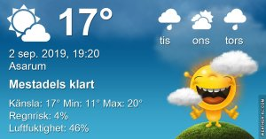

## Måndag 2 September

I dag gryr dagen i Asarum 05:26. Solen går upp klockan 06:06 och ner klockan 19:54 . Det mörknar vid 20:33. Dagens längd är 13 timmar och 48 minuter. Det är dagsljus 15 timmar och 07 minuter. Månen går upp 10:02 och ned 21:21 Månen är belyst 10 %

I Asarum blir dagen 4 minuter och 35 sekunder kortare. Dagen har blivit 3 timmar och 51 minuter kortare sedan sommarsolståndet. Vintersolstånd om 111 dagar.

Missa inte gyllene timmen som börjar klockan 19:06 i Asarum. Då står solen lågt och kastar ett fint gyllene ljus.

 

 Molnigt 12,6 C  Vindby 0,3 m/s NW  Luftfuktighet 91 %  hPa 1008 Kl.01:20

 Växlande molnighet 11,5 C  Vindby 1,2 m/s NNW  Luftfuktighet 94 %   hPa 1009 Kl.07:30

 Växlande molnighet 25,1 C  Vindby 3,4 m/s E  Luftfuktighet 43 %  hPa 1011 Kl.14:30

 Halvklart 11,7 C  Vindby 0,3 m/s S  Luftfuktighet 71 %  hPa 1014 Kl.20:00

Äntligen lite svalare och normala temperaturer

Högst och lägst uppmätta temperatur igår (inofficiellt privat mätare) Max 28 ( i solen ) , Min 15,8 C Högst uppmätta vind 2,7 m/s, Högst uppmätta vindby 4,8 m/s

Högst och lägst uppmätta temperatur igår (officiellt enligt [YR.NO](http://www.vackertvader.se/v%C3%A4derstation/karlshamn?utm_source=email&utm_medium=email&utm_campaign=asarum)) Max ? C, Min ? C Högst uppmätta vind ? m/s. Högst uppmätta vindby ? m/s

## _**I brist på annat blir det några urtavlor igen**_

 

\[gallery type="circle" link="file" size="large" ids="31589,31590,31591,31592,31593,31594,31595,31596,31597,31598,31599,31600"\]

Samma urtavla, olika färger. Vilken är snyggast?
