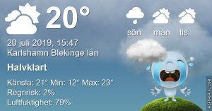

Idag går solen upp 04:42 och ned 21:31 Dagens längd är 16 timmar och 49 minuter. Det är gryning 03:47 och skymning 22:25 Det är dagsljus 18 timmar och 38 minuter. Månen går upp 23:22 och ned 08:18 Månen är belyst 91 %

 Tunna slöjmoln 12,3 C  Vindstilla  Luftfuktighet 97 %  hPa 1010 Kl.01:50

 Disigt och molnigt 15,4 C  Vindstilla  Luftfuktighet 98 %  hPa 1010 Kl.06:55

 Mest molnigt 27,3 C  Vindby 2,6 m/s E  Luftfuktighet 48 %  hPa 1011 Kl.14:45

 Molnigt 18,1 C  Vindby 2 m/s N  Luftfuktighet 78 %  hPa 1010 Kl.20:05

 Det började bra med molnigt och sen tog solen över igen. Och inget regn!

Högst och lägst uppmätta temperatur igår (inofficiellt privat mätare) Max 33 ( i solen )  , Min 8,7 C Högst uppmätta vind 2,4 m/s, Högst uppmätta vindby 4,1 m/s

Högst och lägst uppmätta temperatur igår (officiellt enligt [YR.NO](http://www.vackertvader.se/v%C3%A4derstation/karlshamn?utm_source=email&utm_medium=email&utm_campaign=asarum)) Max 22,9 C, Min 9 C Högst uppmätta vind 3 m/s. Högst uppmätta vindby 6,5 m/s

 

## _**Dagens soluppgång...**_

blev ganska kort men vacker innan molnen tog över. Tyvärr var de tomma och innehållslösa eller bara ovilliga att dela med sig av sitt dyrbara innehåll.

\[gallery type="circle" link="file" size="large" ids="30611,30612,30613,30614"\]

## _**Skarvar på väg någonstans**_

på den molniga himmelen

