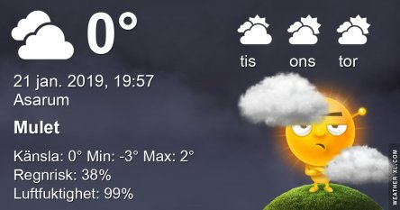

Idag går solen upp 08:16 och ned 16:09 Dagens längd är 7 timmar och 53 minuter. Det är gryning 07:32 och skymning 16:52 Det är dagsljus 9 timmar och 20 minuter. Månen går upp 16:39 och ned 08:23 Månen är belyst 100 %.

Molnigt  och en del snö - 2,2 C  Vindstilla  Luftfuktighet 85 %  hPa 1015 Kl.02:00

 Molnigt - 0,5 C  Vindby 1,4 m/s E  Luftfuktighet 87 %  hPa 1013 Kl.06:50

 Molnigt 1,7 C  Vindby 4 m/s WNW  Luftfuktighet 76 %  hPa 1011 Kl.13:15

 Molnigt - 0,7 C  Vindstilla  Luftfuktighet 85 %  hPa 1009 Kl.19:55

 Nu kom det mer snö igen, helt i onödan enligt min mening. Som väl är så är det varmare väder på väg, igen.

Högst och lägst uppmätta temperatur igår (inofficiellt privat mätare) Max 3 C , Min – 6,2 C Högst uppmätta vind 2 m/s, Högst uppmätta vindby 2,7 m/s

Högst och lägst uppmätta temperatur igår (officiellt enligt [YR.NO](http://www.vackertvader.se/v%C3%A4derstation/karlshamn?utm_source=email&utm_medium=email&utm_campaign=asarum)) Max 0,9 C, Min – 6,3 C Högst uppmätta vind 2,1 m/s. Högst uppmätta vindby 5,8 m/s

\[gallery type="circle" link="file" size="large" ids="26814,26813,26812"\]

Vattentornet vid Malmö Arena i Hyllie

\[gallery type="rectangular" link="file" size="large" ids="26811,26810,26809,26808"\]

En glad snögubbe som heter Olaf från Disney on Ice
