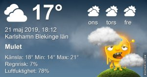

Idag går solen upp 04:37 och ned 21:18 Dagens längd är 16 timmar och 41 minuter. Det är gryning 03:44 och skymning 22:12 Det är dagsljus 18 timmar och 28 minuter. Månen går upp ? och ned 06:46 Månen är belyst 95 %

 

Molnigt 14,9 C  Vindby 1,6 m/s NNE  Luftfuktighet 85 %  hPa 1001 Kl.02:20

 Växlande molnighet 18,5 C  Vindby 2 m/s E  Luftfuktighet 78 %  hPa 1001 Kl.07:40

 Mest molnigt 28,8 C  Vindby 2 m/s E  Luftfuktighet 59 %  hPa 1002 Kl.13:30

 Disigt 12,5 C  Vindby 0,3 m/s SE  Luftfuktighet 90 %  hPa 1004 Kl.21:00

 Ännu en väldigt varm dag!

 

Högst och lägst uppmätta temperatur igår (inofficiellt privat mätare) Max 30,3 ( i solen ) , Min 13,3 C Högst uppmätta vind 2,4 m/s, Högst uppmätta vindby 3,4 m/s

Högst och lägst uppmätta temperatur igår (officiellt enligt [YR.NO](http://www.vackertvader.se/v%C3%A4derstation/karlshamn?utm_source=email&utm_medium=email&utm_campaign=asarum)) Max 23,7 C, Min 13,5 C Högst uppmätta vind 3,5 m/s. Högst uppmätta vindby 6,6 m/s

 

### **_Det blir ett lååångt inlägg idag från Las Vegas_**

\[gallery type="rectangular" link="file" size="large" ids="28951,28952,28953,28955,28956,28963,28964,28965,28966,28967,28968,28969,28970,28971,28972,28973,28974,28975,28976,28977,28978,28979,28980,28981,28982,28983,28984,28985,28986,28987,28988,28989,28990,28991,28992,28993,28994,28995,28996,28997,28998,28999,29000,29001,29002,29003,29004,29005,29006,29007,29008,29009,29010,29011,29012,29013,29014,29015,29016,29017,29018,29019,29020,29021,29022,29023,29024,29025,29026,29027,29028,29029,29030,29031,29032,29033,29034,29035,29036,29037,29038,29039,29040,29041,29042,29043,29044,29045,29046,29047,29048,29049,29050,29051,29052,29053,29054,29055,29056,29057,29058,29059,29060,29061,29062,29063,29064,29065,29066,29067,29068,29069,29070,29071,29072,29073,29074,29075,29076,29077,29083,29082,29081,29080,29079,29078"\]

Nu är vi framme i Las Vegas och ska ut på en guidad tur. Det är varmt och massor av folk överallt. Det blir väldigt många intryck och långt ifrån alla är positiva. Det finns enormt mycket fint att se här men stan lever onekligen upp till sitt smeknamn ( eller öknamn, vilket man vill ) City of Sin. Här är allt tillåtet! Du får röka inne på alla casinona som är gjorda på ett sätt så att du ska glömma tid och rum. Det finns inga fönster i dem för att du ska glömma om det är dag eller natt. De pumpar in syre konstant för att du inte ska bli trött och som sagt du får röka hur mycket du vill och vad du vill för att du inte ska lämna casinot av någon anledning. Det är väldigt svårt att hitta ut om du irrar dig in i ett casino och du kan varken gå in eller ut ur ett hotell utan att gå igenom casinot. Många hotell sitter ihop så att man väldigt lätt går vilse och inte hittar ut.

Något annat som är helt lagligt är att du får köpa prostituerade. Det kör till och med omkring lastbilar med reklam för prostituerade: Ring det här numret så får du upp en tjej på rummet! Helt sjukt enligt mig.

Man såg också reklam för marijuana och cannabis överallt. Däremot fick vi inte köpa alkohol när Johannes stod jämte oss eftersom han inte är 21 som är åldersgränsen i Amerika för att köpa alkohol. Tog han däremot några steg bort så att han stod utanför disken så gick det bra! Snacka om dubbelmoral!

På kvällen när det blev mörkt började alla lättklädda tjejer komma fram och erbjuda sina tjänster på ett ganska diskret sätt. Jag måste säga att vi kände oss enormt malplacerade här.

Johannes var kvar på rummet eftersom han inte mådde bra, han hade oturen att åka på en ordentlig förkylning med halsont, hosta och varande ögon. Så vi lämnade guiden efter fontänuppvisningen och skulle söka upp ett apotek för att köpa medicin till Johannes. Det skulle vi aldrig ha gjort! Det visade sig var betydligt svårare att hitta tillbaka till hotellet än vi trodde. Klockan gick och det blev mörkare och mörkare och mer och mer folk ute så vi började få smått panik eftersom vi skulle upp tidigt för att åka på nästa utflykt. Varmt var det också så svetten rann på ryggen. Det tog oss en och en halv timme att hitta tillbaks och det var egentligen en promenad som skulle ta max en kvart visade det sig när vi väl lärde oss hitta där.

Vi var ordentligt trötta och varma när vi var tillbaka på rummet och vi nästan slogs om vem som skulle duscha först och sen stupade vi i säng. Stackars Johannes mådde inte bra och vi hoppades att han skulle repa sig lite till morgondagen, men det visade sig att den förkylningen höll i sig hela resan och en bra bit efter vi kommit hem.

 

Den här låten gick vi och sjöng på när vi var där! Det gick inte att få den ur huvudet av någon anledning, hahaha!

https://www.youtube.com/watch?v=Go4lFT4Mwl8
