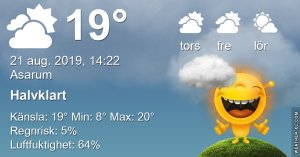

## Torsdag 22 augusti

I dag gryr dagen i Asarum 05:02. Solen går upp klockan 05:44 och ner klockan 20:22 . Det mörknar vid 21:03. Dagens längd är 14 timmar och 38 minuter. Det är dagsljus 16 timmar och 01 minuter. Månen går upp 22:56 och ned 13:06 Månen är belyst 66 %

I Asarum blir dagen 4 minuter och 25 sekunder kortare. Dagen har blivit 3 timmar och 2 minuter kortare sedan sommarsolståndet. Vintersolstånd om 122 dagar.

Missa inte gyllene timmen som börjar klockan 19:33 i Asarum. Då står solen lågt och kastar ett fint gyllene ljus.

 

 Klart 5,7 C  Vindstilla  Luftfuktighet 99 %  hPa 1023 Kl.02:20

 Tunna slöjmoln 8,8 C  Vindstilla  Luftfuktighet 97 %  hPa 1023 Kl.07:20

 Tunna slöjmoln 25,1 C  Vindby 3,6 m/s S   Luftfuktighet 53 %  hPa 1022 Kl.14:05

 Tunna slöjmoln 15,7 C  Vindby 1 m/s NE  Luftfuktighet 68 %  hPa 1021 Kl.20:25

Nu är sommaren tillbaka med upp mot 25 grader igen efter en kall natt.

Högst och lägst uppmätta temperatur igår (inofficiellt privat mätare) Max 26,8 ( i solen ) , Min 7,9 C Högst uppmätta vind 3,1 m/s, Högst uppmätta vindby 5,1 m/s

Högst och lägst uppmätta temperatur igår (officiellt enligt [YR.NO](http://www.vackertvader.se/v%C3%A4derstation/karlshamn?utm_source=email&utm_medium=email&utm_campaign=asarum)) Max 21,3 C, Min 6,2 C Högst uppmätta vind 3,6 m/s. Högst uppmätta vindby 8,5 m/s

## _**Brist på tid...**_

efter en gigantiskt jobb med trädgården som jag dragit ut på länge nog, gör att jag inte hinner eller orkar leta bilder till bloggen. Så det blir mer reklam för mina urtavlor igen. De här är mina mest avancerade jag har gjort.

\[gallery type="circle" link="file" size="large" ids="31326,31327,31328,31329,31330,31331,31332"\]

De fem första är samma urtavla i olika färger. De sista två är egentligen bara en som man kan byta färg på själv efter humör eller vad man ska göra för dagen.
