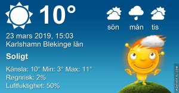

Idag går solen upp 05:56 och ned 18:20 Dagens längd är 12 timmar och 24 minuter. Det är gryning 05:19 och skymning 18:57 Det är dagsljus 13 timmar och 38 minuter. Månen går upp 21:44 och ned 07:14 Månen är belyst 95 %

 Molnigt och duggregn 5 C  Vindby 0,3 m/s N  Luftfuktighet 91 %  hPa 1021 Kl.01:20

 Dimma 5,5 C  Vindby 1,7 m/s N  Luftfuktighet 93 %  hPa 1017 Kl.06:30

 Växlande molnighet 14,2 C  Vindby 4,8 m/s SE  Luftfuktighet 47 %  hPa 1018 Kl.14:15

 Klart 3,5 C  Vindby 2,7 m/s S  Luftfuktighet 56 %  hPa 1020 Kl.20:05

 Idag har det varit en härlig men blåsig vårdag!

Högst och lägst uppmätta temperatur igår (inofficiellt privat mätare) Max 15,2 , Min 0,1 C Högst uppmätta vind 3,7 m/s, Högst uppmätta vindby 4,8 m/s

Högst och lägst uppmätta temperatur igår (officiellt enligt [YR.NO](http://www.vackertvader.se/v%C3%A4derstation/karlshamn?utm_source=email&utm_medium=email&utm_campaign=asarum)) Max 9,8 C, Min 1,1 C Högst uppmätta vind 5,3 m/s. Högst uppmätta vindby 9,1 m/s

 Kloka ord från ugglorna!
