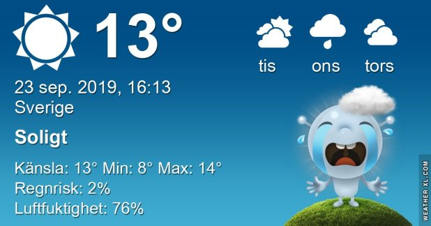

## Måndag 23 September

I dag gryr dagen i Asarum 06:09. Solen går upp klockan 06:47 och ner klockan 18:58 . Det mörknar vid 19:35. Dagens längd är 12 timmar och 11 minuter. Det är dagsljus 13 timmar och 26 minuter. Månen går upp ? och ned 16:39 Månen är belyst 40 %

I Asarum blir dagen 4 minuter och 40 sekunder kortare. Dagen har blivit 5 timmar och 29 minuter kortare sedan sommarsolståndet. Vintersolstånd om 90 dagar.

Missa inte gyllene timmen som börjar klockan 18:11 i Asarum. Då står solen lågt och kastar ett fint gyllene ljus

 

 Molnigt 10 C  Vindby 3,8 m/s W  Luftfuktighet 77 %  hPa 1016 Kl.02:05

 Tunna slöjmoln 7,5 C  Vindby 1,4 m/s SW  Luftfuktighet 81 %  hPa 1015 Kl.06:25

 Klart 18,1 C  Vindby 3,7 m/s NW  Luftfuktighet 49 %  hPa 1016 Kl.14:20

 Mest klart 5,8 C  Vind0,3 m/s NW  Luftfuktighet 82 %  hPa 1015 Kl.20:15

 Nu är det slut med sommarvädret och hösten kommer med stormsteg. Det ska bli ordentligt kallare nu!

Högst och lägst uppmätta temperatur igår (inofficiellt privat mätare) Max 27,7 C ( i solen ), Min  4,2 C Högst uppmätta vind 2,4 m/s, Högst uppmätta vindby 4,8 m/s

Högst och lägst uppmätta temperatur igår (officiellt enligt [YR.NO](http://www.vackertvader.se/v%C3%A4derstation/karlshamn?utm_source=email&utm_medium=email&utm_campaign=asarum)) Max 20 C, Min 3,2 C Högst uppmätta vind 3,7 m/s. Högst uppmätta vindby 10,4 m/s

## _**För trött för att lägga upp något...**_

efter en hel kväll hos äldsta sonen i hans trädgård! Jag är helt slut nu!

