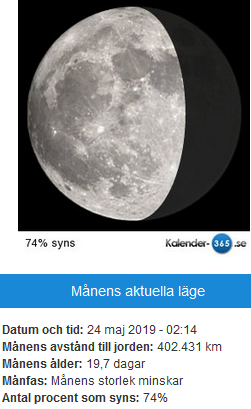

Idag går solen upp 07:03 och ned 17:25 Dagens längd är 10 timmar och 22 minuter. Det är gryning 06:25 och skymning 18:03 Det är dagsljus 11 timmar och 38 minuter. Månen går upp 00:10 och ned 09:36 Månen är belyst 65 %

 Molnigt 3,3 C  Vindby 2,4 m/s SW  Luftfuktighet 89 %  hPa 1013 Kl.02:15

 Tunna moln 2,4 C  Vindby 3,4 m/s S  Luftfuktighet 91 %  hPa 1029 Kl.06:30

 Tunna slöjmoln 12,4 C  Vindby 2,7 m/s S  Luftfuktighet 43 %  hPa 1027 Kl.13:05

 Mest klart 3,6 C  Vindby 0,7 m/s N  Luftfuktighet 75 %  hPa 1025 Kl.20:05

 Ännu en solig och fin dag, men inte lika varm som igen

Högst och lägst uppmätta temperatur igår (inofficiellt privat mätare) Max 19,2 ( i solen ) , Min 0,1 C Högst uppmätta vind 3,1 m/s, Högst uppmätta vindby 4,1 m/s

Högst och lägst uppmätta temperatur igår (officiellt enligt [YR.NO](http://www.vackertvader.se/v%C3%A4derstation/karlshamn?utm_source=email&utm_medium=email&utm_campaign=asarum)) Max 14 C, Min – 0,2 C Högst uppmätta vind 2,2 m/s. Högst uppmätta vindby 8,9 m/s

\[gallery type="rectangular" link="file" size="large" ids="27460,27461,27462,27463,27464,27465" orderby="rand"\]

Dags för lite Minioner och annat igen.
