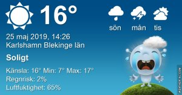

Idag går solen upp 04:31 och ned 21:25 Dagens längd är 16 timmar och 54 minuter. Det är gryning 03:36 och skymning 22:20 Det är dagsljus 18 timmar och 44 minuter. Månen går upp 02:12 och ned 10:22 Månen är belyst 66 %

 Mest klart 6 C  Vindstilla  Luftfuktighet 97 %  hPa 1004 Kl.02:25

 Molnigt 11,7 C  Vindby 1,8 m/s NE  Luftfuktighet 85 %  hPa 1005 Kl.07:45

 Växlande molnighet 24,3 C  Vindby 3 m/s W  Luftfuktighet 50 %  hPa 1005 Kl.13:10

 Halvklart 14,8 C  Vindby 1,8 m/s W  Luftfuktighet 54 %  hPa 1005 Kl.20:00

 Lagom varmt och riktigt skönt väder men.... det behövs regn i massor!

Högst och lägst uppmätta temperatur igår (inofficiellt privat mätare) Max 24,6 ( i solen ) , Min 5,2 C Högst uppmätta vind 4,4 m/s, Högst uppmätta vindby 8,2 m/s

Högst och lägst uppmätta temperatur igår (officiellt enligt [YR.NO](http://www.vackertvader.se/v%C3%A4derstation/karlshamn?utm_source=email&utm_medium=email&utm_campaign=asarum)) Max 16,8 C, Min 4,8 C Högst uppmätta vind 3,7 m/s. Högst uppmätta vindby 8,2 m/s

 

## **_Sedona Arizona_**

\[gallery type="rectangular" link="file" size="large" ids="29209,29210,29211,29212,29213,29214,29215,29216,29217,29218,29219,29220,29221,29222,29223,29224,29225,29226,29227,29228,29229,29230,29231,29232,29233,29234,29235,29236,29237,29238,29239,29240,29241,29242,29243,29244,29245,29246,29247,29248,29249,29250,29251,29252,29256,29257,29259,29260"\]

Nu har turen kommit till Sedona, en helt otrolig liten by i Arizona. Du kan läsa om den [här](https://en.wikipedia.org/wiki/Sedona,_Arizona).  Här önskar jag att vi hade stannat mycket längre för det hade funnits hur mycket som helst att se och göra. Men vi fick ändå se mycket och kunde strosa omkring och njuta av känslan av att vara på en annan planet bitvis. Så vackert så det går inte att beskriva i ord. Bilderna får tala för sig själva helt enkelt.
