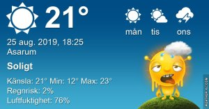

## Söndag 25 augusti

I dag gryr dagen i Asarum 05:09. Solen går upp klockan 05:50 och ner klockan 20:14 . Det mörknar vid 20:55. Dagens längd är 14 timmar och 24 minuter. Det är dagsljus 15 timmar och 46 minuter. Månen går upp ? och ned 16:47 Månen är belyst 37 %

I Asarum blir dagen 4 minuter och 29 sekunder kortare. Dagen har blivit 3 timmar och 15 minuter kortare sedan sommarsolståndet. Vintersolstånd om 119 dagar.

Missa inte gyllene timmen som börjar klockan 19:28 i Asarum. Då står solen lågt och kastar ett fint gyllene ljus.

 

 Mest klart 10,8 C  Vindstilla  Luftfuktighet 97 %  hPa 1022 Kl.01:25

 Molnigt 14,9 C  Vindby 2,7 m/s N  Luftfuktighet 83 %  hPa 1006 Kl.06:40

 Växlande molnighet och höga slöjmoln 28,4 C  Vindby 2,2 m/s S  Luftfuktighet 61 %  hPa 1021 KL.13:45

 Mest klart 17,6 C  Vindstilla  Luftfuktighet 85 %  hPa 1020 Kl.20:05

Ännu varmare idag än igår!

Högst och lägst uppmätta temperatur igår (inofficiellt privat mätare) Max 35 ( i solen ) , Min 9,9 C Högst uppmätta vind 2,4 m/s, Högst uppmätta vindby 4,1 m/s

Högst och lägst uppmätta temperatur igår (officiellt enligt [YR.NO](http://www.vackertvader.se/v%C3%A4derstation/karlshamn?utm_source=email&utm_medium=email&utm_campaign=asarum)) Max 23,7 C, Min 9,2 C Högst uppmätta vind 3,1 m/s. Högst uppmätta vindby 6,6 m/s

## _**Hinner inte blogga så mycket just nu...**_

så det blir bara några urtavlor igen.

 

\[gallery type="circle" link="file" size="large" ids="31394,31395,31396"\]
